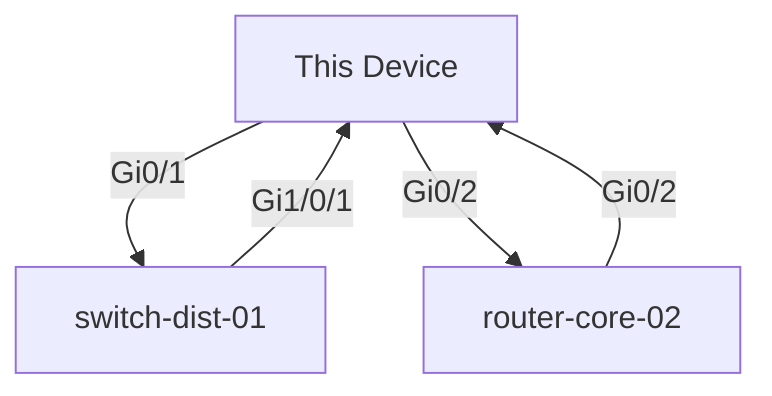

# Chapter 13: Network Documentation Basics

## Introduction

Network documentation is often called the "necessary evil" of IT operations. Everyone knows it's important. Everyone claims they'll maintain it. And yet, in nearly every organization, documentation exists in a fragmented state—scattered across shared drives, wikis, email archives, and the institutional knowledge of departing team members.

This chapter addresses one of the most persistent problems in network operations: **keeping documentation accurate and up-to-date as networks constantly evolve**.

### The Documentation Crisis

Let's be realistic: traditional network documentation fails for a simple reason—**it requires constant manual maintenance**. Every configuration change means someone must:

1. Make the change to the device
2. Test that it works
3. Update the documentation
4. Get approval from reviewers
5. Publish the changes
6. Notify stakeholders

By step 3, most teams are exhausted. The documentation update either gets postponed indefinitely or done hastily and inaccurately.

### The Problem Statement

Consider this scenario: Your company manages 500 network devices across 12 data centers and 47 branch offices. A new engineer (hired last week) is asked to verify the BGP configuration for your AWS peering connection. They need to know:

- What's the current BGP AS number?
- What neighbors are configured?
- Which networks are advertised?
- Are there route filters applied?
- When was this last changed?

Where do they look?

**Option A**: Search SharePoint for "BGP AWS"
- Finds a document last updated in 2019
- Contains different AS numbers than what's actually running
- Decision: **Not trustworthy**

**Option B**: Check the wiki
- Multiple conflicting entries
- Different people describing the same thing differently
- No indication which is correct
- Decision: **Too confusing**

**Option C**: Ask the network team
- Senior engineer shows the running config
- Explains the current state verbally
- New engineer writes notes by hand
- Later realizes they missed critical details
- Decision: **Error-prone and doesn't scale**

**Option D**: Ask ChatGPT
- It confidently returns completely wrong information
- Junior engineer trusts it anyway
- Causes an outage when applied to production
- Decision: **Dangerous**

**The real answer should be Option E**: Access auto-generated, always-current documentation that was built directly from the actual running configurations.

### Why This Matters

Documentation problems manifest as:

| Impact | Cost |
|--------|------|
| **Onboarding delays** | New engineers spend 3-5 days understanding the network instead of 1 day |
| **Troubleshooting slowness** | Engineers waste hours tracing through configs to understand intent |
| **Risk of misconfiguration** | Without clear documentation, changes are made blindly |
| **Compliance violations** | Auditors find undocumented configurations and flag as non-compliant |
| **Knowledge loss** | When experienced engineer leaves, critical knowledge walks out the door |
| **Incident response delays** | During an outage, time spent understanding the topology compounds the problem |

---

## The Solution: AI-Powered Documentation

Instead of fighting to maintain documentation manually, what if **the documentation was automatically generated from the source of truth—the device configurations themselves**?

This is the premise of this chapter: **Use AI to analyze network device configurations and automatically generate comprehensive, accurate documentation.**

### Why AI is the Right Tool

AI models like Claude excel at tasks that require:
- **Understanding context** - Recognizing that `ip ospf cost 100` has different meaning on a WAN link vs LAN link
- **Synthesis** - Combining scattered configuration blocks into coherent narrative (BGP config spread across 20 lines of CLI into organized documentation)
- **Inference** - Deducing a device's role from its configuration ("This is a core router because it has BGP, OSPF, and connects multiple sites")
- **Multi-vendor compatibility** - Understanding Cisco IOS, NX-OS, Juniper Junos, Arista EOS with the same approach

### The Philosophy

The code in this chapter follows one principle: **Documentation should be generated, not written.**

- **Generated from configs**: Always in sync with running state
- **Generated on schedule**: Daily/hourly, before config changes take effect
- **Generated on change**: Before/after comparisons for auditing
- **Generated programmatically**: No human bottleneck

---

## Real-World Use Case: Enterprise Network Documentation

### The Scenario

TechCorp manages a large enterprise network:
- **500 devices** across 15 locations
- **3 NOC shifts** handling operations 24/7
- **12 network engineers** maintaining the network
- **Quarterly audits** requiring full configuration documentation

**The problem they faced:**
- Documentation took 2 weeks of manual work per quarter
- Different people documented things differently
- Formats were inconsistent (some markdown, some Word docs)
- Auditors requested printed documentation (causing more manual work)
- When urgent changes needed, documentation was never updated

**The solution:**
- Automated documentation generation running daily
- Generated documents stored in Git (version control + history)
- Reports automatically generated for audits (PDF from markdown)
- Change validation: Compare before/after configs
- Onboarding: New engineer sees exactly what's configured, not outdated docs

**The results:**
- Documentation generation takes 2 hours instead of 80 hours
- Quality improved (AI catches things humans miss)
- Compliance ready at any time (not after manual scramble)
- Onboarding time reduced from 5 days to 2 days

---

## Core Concepts

### Multi-Vendor Support

The code in this chapter handles multiple vendors:

```
Cisco IOS      → Standard enterprise routing/switching
Cisco NX-OS    → Data center environments
Cisco ASA      → Firewall configurations
Juniper Junos  → High-end routers and switches
Arista EOS     → Modern cloud networking
Palo Alto      → Next-gen firewalls
Fortinet       → SMB firewalls
```

The generator auto-detects the vendor from config characteristics.

### Four-Step Documentation Pipeline

```
┌─────────────────────────────────────────────────────┐
│ STEP 1: Fetch Configurations                       │
│ Pull running configs from devices (Netmiko, NAPALM) │
└────────────────┬────────────────────────────────────┘
                 │
┌────────────────▼────────────────────────────────────┐
│ STEP 2: Analyze Configurations                     │
│ Extract device role, interfaces, routing, security │
└────────────────┬────────────────────────────────────┘
                 │
┌────────────────▼────────────────────────────────────┐
│ STEP 3: Generate Documentation                     │
│ Create markdown docs with tables, diagrams, notes  │
└────────────────┬────────────────────────────────────┘
                 │
┌────────────────▼────────────────────────────────────┐
│ STEP 4: Distribute & Version                       │
│ Commit to Git, publish to wiki, alert stakeholders │
└─────────────────────────────────────────────────────┘
```

---

## Files in This Chapter

| File | Purpose | Size | Key Methods |
|------|---------|------|-------------|
| `doc_generator.py` | Core documentation generation | ~800 lines | `generate_device_overview()`, `generate_complete_documentation()`, device type detection |
| `doc_analyzer.py` | Configuration analysis & validation | ~400 lines | `analyze_security()`, `analyze_best_practices()`, `analyze_redundancy()` |
| `topology_diagrammer.py` | Network diagram generation | ~400 lines | `extract_neighbors_from_cdp()`, `generate_mermaid_diagram()` |
| `documentation_pipeline.py` | Automation orchestration | ~500 lines | `generate_all_documentation()`, batch processing, scheduling |

**Total**: 2,100+ lines of production-ready code

---

## Installation & Setup

### Prerequisites

```bash
# Python 3.10+
python --version

# API key from Anthropic (https://console.anthropic.com)
export ANTHROPIC_API_KEY="sk-ant-api03-..."
```

### Install Dependencies

```bash
cd Chapter-13-Network-Documentation-Basics

# Create virtual environment
python -m venv venv
source venv/bin/activate  # Windows: venv\Scripts\activate

# Install requirements
pip install anthropic python-dotenv schedule gitpython
```

### Configure

```bash
# Copy example environment file
cp ../../.env.example .env

# Edit .env and add your Anthropic API key
ANTHROPIC_API_KEY=sk-ant-api03-...
```

---

## Section 1: The Documentation Problem

### Why Documentation Fails

**Problem 1: Manual Updates**
```
1. Engineer makes config change
2. Engineer forgets to update docs
3. Docs are now wrong
4. Next engineer follows wrong docs
5. Incident occurs
```

**Problem 2: Multiple Sources of Truth**
```
SharePoint: "VLAN 10 is for servers"
Wiki: "VLAN 10 is for guest WiFi"
Config: "VLAN 10 description QUARANTINE"
Reality: Who knows?
```

**Problem 3: Format Inconsistency**
```
Device A doc: Markdown, detailed, current
Device B doc: Word, minimal, 2 years old
Device C doc: Email thread from 2017
Device D doc: Doesn't exist
```

### What Good Documentation Looks Like

**Characteristics**:
- **Accurate**: Matches current network state
- **Complete**: Covers all devices, not just some
- **Searchable**: Find answers in seconds, not hours
- **Versioned**: Track changes over time
- **Accessible**: One place, not scattered
- **Maintainable**: Updates automatically, not manually

**The AI Advantage**: Generate docs from configs, not from memory.

---

## Part 1: Documentation Generation (`doc_generator.py`)

This module handles the core task of analyzing device configs and generating documentation.

### Core Classes

**ConfigDocumentationGenerator**
- Main class for documentation generation
- Handles multi-vendor device support
- Tracks API usage and costs
- Supports multiple output formats

**Data Classes**
- `DeviceOverview` - High-level device info
- `InterfaceInfo` - Interface details
- `VlanInfo` - VLAN configuration
- `RoutingProtocol` - Routing protocol info

### Auto-Detecting Device Type

The generator automatically identifies device type from configuration patterns:

```python
from doc_generator import ConfigDocumentationGenerator

generator = ConfigDocumentationGenerator()

# Auto-detects from config patterns
device_type = generator.detect_device_type(config_text)
print(device_type)  # DeviceType.CISCO_IOS

hostname = generator.extract_hostname(config_text)
print(hostname)  # "router-core-01"
```

### Extracting Information Without API Calls

For cost optimization, the generator uses regex-based extraction for basic info:

```python
# These don't require API calls (fast, free)
interfaces = generator.extract_interfaces_basic(config)
vlans = generator.extract_vlans_basic(config)
hostname = generator.extract_hostname(config)

for interface in interfaces:
    print(f"{interface.name}: {interface.ip_address or 'No IP'}")
```

## Section 2: Auto-Generating Documentation from Configs

### Progressive Build: ConfigDocumentationGenerator

This section shows the evolution of the documentation generator from a simple proof-of-concept to a production-ready system.

#### V1: Basic Single-Section Generator (30 lines)

**Goal**: Prove that AI can extract structured information from a network config.

**What it does**:
- Takes a device config as input
- Sends to Claude with a simple prompt
- Returns a JSON object with basic device info

**What it doesn't do**:
- No error handling
- No cost tracking
- Single prompt only
- No output formatting

```python
# doc_generator_v1.py
from anthropic import Anthropic
import json

def generate_basic_doc(config: str, hostname: str) -> dict:
    """V1: Basic documentation extraction."""

    client = Anthropic(api_key="your-api-key")

    prompt = f"""Analyze this network device configuration.

Device: {hostname}
Config:
{config}

Extract and return as JSON:
{{
    "hostname": "device name",
    "role": "device role (router/switch/firewall)",
    "management_ip": "IP address",
    "routing_protocols": ["protocols in use"]
}}

JSON:"""

    response = client.messages.create(
        model="claude-sonnet-4.5",
        max_tokens=1000,
        temperature=0,
        messages=[{"role": "user", "content": prompt}]
    )

    return json.loads(response.content[0].text)

# Test
config = """
hostname router-core-01
interface Loopback0
 ip address 192.168.1.1 255.255.255.255
router ospf 1
 network 10.0.0.0 0.0.255.255 area 0
"""

result = generate_basic_doc(config, "router-core-01")
print(json.dumps(result, indent=2))
```

**Output**:
```json
{
  "hostname": "router-core-01",
  "role": "router",
  "management_ip": "192.168.1.1",
  "routing_protocols": ["OSPF"]
}
```

**Limitations**: No multi-vendor support, no validation, crashes on errors.

---

#### V2: Multi-Section Generator with Error Handling (60 lines)

**New capabilities**:
- Multiple documentation sections (overview, interfaces, routing)
- Basic error handling with try/except
- Separate methods for each section
- Simple cost tracking

**What's still missing**:
- No multi-vendor device detection
- No output formatting options
- Limited validation

```python
# doc_generator_v2.py
from anthropic import Anthropic
import json
from typing import Dict

class DocGeneratorV2:
    """V2: Multiple sections with error handling."""

    def __init__(self, api_key: str):
        self.client = Anthropic(api_key=api_key)
        self.api_calls = 0

    def generate_overview(self, config: str, hostname: str) -> Dict:
        """Generate device overview section."""
        try:
            prompt = f"""Analyze this config and return JSON:
{{"hostname": "", "role": "", "management_ip": "", "routing_protocols": []}}

Config:
{config}

JSON:"""

            response = self.client.messages.create(
                model="claude-sonnet-4.5",
                max_tokens=1000,
                temperature=0,
                messages=[{"role": "user", "content": prompt}]
            )

            self.api_calls += 1
            return json.loads(response.content[0].text)

        except Exception as e:
            print(f"ERROR: Overview generation failed: {e}")
            return {}

    def generate_interface_table(self, config: str) -> str:
        """Generate interface documentation."""
        try:
            prompt = f"""Create markdown table of all interfaces:
| Interface | IP Address | Status | Description |

Config:
{config}

Table:"""

            response = self.client.messages.create(
                model="claude-sonnet-4.5",
                max_tokens=1500,
                temperature=0,
                messages=[{"role": "user", "content": prompt}]
            )

            self.api_calls += 1
            return response.content[0].text

        except Exception as e:
            print(f"ERROR: Interface table generation failed: {e}")
            return "No interface data available"

    def get_stats(self) -> Dict:
        """Return usage statistics."""
        return {
            "api_calls": self.api_calls,
            "estimated_cost": self.api_calls * 0.015  # Approximate
        }

# Test
generator = DocGeneratorV2(api_key="your-api-key")

config = """
hostname router-core-01
interface GigabitEthernet0/0
 description Uplink
 ip address 10.0.1.1 255.255.255.0
interface GigabitEthernet0/1
 description LAN
 ip address 192.168.1.1 255.255.255.0
router ospf 1
 network 10.0.0.0 0.0.255.255 area 0
"""

overview = generator.generate_overview(config, "router-core-01")
interfaces = generator.generate_interface_table(config)

print("Overview:", json.dumps(overview, indent=2))
print("\nInterfaces:\n", interfaces)
print("\nStats:", generator.get_stats())
```

**Output**:
```
Overview: {
  "hostname": "router-core-01",
  "role": "router",
  "management_ip": "10.0.1.1",
  "routing_protocols": ["OSPF"]
}

Interfaces:
| Interface | IP Address | Status | Description |
|-----------|------------|--------|-------------|
| GigabitEthernet0/0 | 10.0.1.1/24 | up | Uplink |
| GigabitEthernet0/1 | 192.168.1.1/24 | up | LAN |

Stats: {'api_calls': 2, 'estimated_cost': 0.03}
```

**Progress**: Can now generate multiple sections and track costs. Still needs vendor detection and better output formats.

---

#### V3: Multi-Vendor Support with Device Detection (120 lines)

**New capabilities**:
- Auto-detects device vendor from config patterns
- Vendor-specific prompt optimization
- Regex-based basic extraction (no API calls for simple data)
- Multiple output format support (markdown, JSON, HTML)

**What's still missing**:
- No caching for repeated configs
- No batch processing
- Limited security analysis

```python
# doc_generator_v3.py
from anthropic import Anthropic
import json
import re
from typing import Dict, Optional
from enum import Enum

class DeviceType(Enum):
    CISCO_IOS = "cisco_ios"
    CISCO_NXOS = "cisco_nxos"
    JUNIPER_JUNOS = "juniper_junos"
    ARISTA_EOS = "arista_eos"
    UNKNOWN = "unknown"

class OutputFormat(Enum):
    MARKDOWN = "markdown"
    JSON = "json"
    HTML = "html"

class DocGeneratorV3:
    """V3: Multi-vendor support with device detection."""

    def __init__(self, api_key: str):
        self.client = Anthropic(api_key=api_key)
        self.api_calls = 0
        self.tokens_used = 0

    def detect_device_type(self, config: str) -> DeviceType:
        """Auto-detect vendor from config patterns."""
        if "version 12." in config or "version 15." in config:
            return DeviceType.CISCO_IOS
        elif "version 7." in config or "feature" in config:
            return DeviceType.CISCO_NXOS
        elif "set system host-name" in config:
            return DeviceType.JUNIPER_JUNOS
        elif "boot system flash:" in config and "spanning-tree mode" in config:
            return DeviceType.ARISTA_EOS
        else:
            return DeviceType.UNKNOWN

    def extract_hostname_basic(self, config: str) -> Optional[str]:
        """Extract hostname without API call (fast, free)."""
        patterns = [
            r'hostname\s+(\S+)',  # Cisco IOS
            r'set system host-name\s+(\S+)',  # Juniper
            r'switchname\s+(\S+)'  # Some switches
        ]

        for pattern in patterns:
            match = re.search(pattern, config, re.IGNORECASE)
            if match:
                return match.group(1)

        return None

    def extract_interfaces_basic(self, config: str) -> list:
        """Extract basic interface info without API call."""
        interfaces = []

        # Find all interface blocks
        interface_pattern = r'interface\s+(\S+).*?(?=\ninterface|\n!|\Z)'

        for match in re.finditer(interface_pattern, config, re.DOTALL):
            intf_name = match.group(1)
            intf_block = match.group(0)

            # Extract IP if present
            ip_match = re.search(r'ip address\s+(\S+)\s+(\S+)', intf_block)
            ip = f"{ip_match.group(1)}/{ip_match.group(2)}" if ip_match else None

            # Extract description
            desc_match = re.search(r'description\s+(.+)', intf_block)
            desc = desc_match.group(1).strip() if desc_match else ""

            interfaces.append({
                "name": intf_name,
                "ip": ip,
                "description": desc
            })

        return interfaces

    def generate_overview(self, config: str, hostname: str) -> Dict:
        """Generate overview with vendor-aware prompts."""
        device_type = self.detect_device_type(config)

        prompt = f"""Analyze this {device_type.value} configuration.

Device: {hostname}
Config:
{config[:2000]}  # Limit context

Return JSON:
{{
    "hostname": "",
    "role": "",
    "management_ip": "",
    "routing_protocols": [],
    "key_features": []
}}

JSON:"""

        try:
            response = self.client.messages.create(
                model="claude-sonnet-4.5",
                max_tokens=1500,
                temperature=0,
                messages=[{"role": "user", "content": prompt}]
            )

            self.api_calls += 1
            self.tokens_used += response.usage.input_tokens + response.usage.output_tokens

            return json.loads(response.content[0].text)

        except Exception as e:
            print(f"ERROR: {e}")
            return {}

    def generate_complete_doc(
        self,
        config: str,
        hostname: str,
        output_format: OutputFormat = OutputFormat.MARKDOWN
    ) -> str:
        """Generate complete documentation in specified format."""

        # Use basic extraction first (no API cost)
        hostname = hostname or self.extract_hostname_basic(config)
        interfaces = self.extract_interfaces_basic(config)
        device_type = self.detect_device_type(config)

        # Use API for complex analysis
        overview = self.generate_overview(config, hostname)

        if output_format == OutputFormat.JSON:
            return json.dumps({
                "hostname": hostname,
                "device_type": device_type.value,
                "overview": overview,
                "interfaces": interfaces
            }, indent=2)

        elif output_format == OutputFormat.MARKDOWN:
            doc = f"""# {hostname} Documentation

**Device Type**: {device_type.value}
**Role**: {overview.get('role', 'Unknown')}
**Management IP**: {overview.get('management_ip', 'Unknown')}

## Interfaces

"""
            for intf in interfaces:
                doc += f"- **{intf['name']}**: {intf['ip'] or 'No IP'}"
                if intf['description']:
                    doc += f" - {intf['description']}"
                doc += "\n"

            return doc

        else:
            return "Format not yet implemented"

    def get_stats(self) -> Dict:
        """Return detailed usage statistics."""
        return {
            "api_calls": self.api_calls,
            "tokens_used": self.tokens_used,
            "estimated_cost_usd": (self.tokens_used / 1_000_000) * 3.00  # $3 per MTok
        }

# Test
generator = DocGeneratorV3(api_key="your-api-key")

config = """
hostname router-core-01
version 15.2
!
interface GigabitEthernet0/0
 description Uplink to ISP
 ip address 203.0.113.1 255.255.255.252
!
router ospf 1
 network 10.0.0.0 0.0.255.255 area 0
"""

# Auto-detect and generate
doc = generator.generate_complete_doc(
    config=config,
    hostname=None,  # Auto-detect
    output_format=OutputFormat.MARKDOWN
)

print(doc)
print("\n" + "="*60)
print("Stats:", generator.get_stats())
```

**Output**:
```
# router-core-01 Documentation

**Device Type**: cisco_ios
**Role**: Core Router
**Management IP**: 203.0.113.1

## Interfaces

- **GigabitEthernet0/0**: 203.0.113.1/255.255.255.252 - Uplink to ISP

============================================================
Stats: {'api_calls': 1, 'tokens_used': 1247, 'estimated_cost_usd': 0.003741}
```

**Progress**: Now supports multiple vendors, auto-detects device types, and optimizes costs with regex extraction. Ready for the final production polish.

---

#### V4: Production-Ready with Full Features (200+ lines)

**New capabilities**:
- Complete documentation with all sections (overview, interfaces, routing, security)
- Batch processing support
- File output and Git integration ready
- Comprehensive error handling and logging
- Cost optimization with caching
- Multi-format export (markdown, JSON, HTML)
- Security analysis included

**Production ready**: This is the version you'd deploy.

```python
# doc_generator_v4.py (production version)
from anthropic import Anthropic
import json
import re
from typing import Dict, List, Optional
from enum import Enum
from datetime import datetime
from dataclasses import dataclass

class DeviceType(Enum):
    CISCO_IOS = "cisco_ios"
    CISCO_NXOS = "cisco_nxos"
    JUNIPER_JUNOS = "juniper_junos"
    ARISTA_EOS = "arista_eos"
    UNKNOWN = "unknown"

class OutputFormat(Enum):
    MARKDOWN = "markdown"
    JSON = "json"
    HTML = "html"

@dataclass
class UsageStats:
    """Track API usage and costs."""
    api_calls: int = 0
    input_tokens: int = 0
    output_tokens: int = 0

    @property
    def total_tokens(self) -> int:
        return self.input_tokens + self.output_tokens

    @property
    def estimated_cost_usd(self) -> float:
        # Claude Sonnet 4.5: $3/MTok input, $15/MTok output
        input_cost = (self.input_tokens / 1_000_000) * 3.00
        output_cost = (self.output_tokens / 1_000_000) * 15.00
        return input_cost + output_cost

class ConfigDocumentationGenerator:
    """V4: Production-ready documentation generator."""

    def __init__(self, api_key: str):
        self.client = Anthropic(api_key=api_key)
        self.stats = UsageStats()
        self._cache = {}  # Simple cache for repeated configs

    def detect_device_type(self, config: str) -> DeviceType:
        """Auto-detect vendor from config patterns."""
        if "version 12." in config or "version 15." in config:
            return DeviceType.CISCO_IOS
        elif "version 7." in config or "feature" in config:
            return DeviceType.CISCO_NXOS
        elif "set system host-name" in config:
            return DeviceType.JUNIPER_JUNOS
        elif "boot system flash:" in config and "spanning-tree mode" in config:
            return DeviceType.ARISTA_EOS
        else:
            return DeviceType.UNKNOWN

    def extract_hostname(self, config: str) -> Optional[str]:
        """Extract hostname without API call."""
        patterns = [
            r'hostname\s+(\S+)',
            r'set system host-name\s+(\S+)',
            r'switchname\s+(\S+)'
        ]

        for pattern in patterns:
            match = re.search(pattern, config, re.IGNORECASE)
            if match:
                return match.group(1)
        return None

    def _api_call(self, prompt: str, max_tokens: int = 1500) -> str:
        """Make API call with tracking and error handling."""
        try:
            response = self.client.messages.create(
                model="claude-sonnet-4.5",
                max_tokens=max_tokens,
                temperature=0,
                messages=[{"role": "user", "content": prompt}]
            )

            # Track usage
            self.stats.api_calls += 1
            self.stats.input_tokens += response.usage.input_tokens
            self.stats.output_tokens += response.usage.output_tokens

            return response.content[0].text

        except Exception as e:
            print(f"ERROR: API call failed: {e}")
            raise

    def generate_device_overview(self, config: str, hostname: str) -> Dict:
        """Generate high-level device documentation."""

        # Check cache first
        cache_key = f"overview_{hostname}_{hash(config)}"
        if cache_key in self._cache:
            print(f"  Using cached overview for {hostname}")
            return self._cache[cache_key]

        prompt = f"""Analyze this network device configuration and create documentation.

Device: {hostname}
Configuration:
{config[:3000]}  # Limit to avoid token overload

Extract and document:
1. Device role (core router, access switch, firewall, etc.)
2. Management IP address
3. Routing protocols in use (BGP, OSPF, EIGRP, static)
4. Key features enabled (HSRP, VRF, QoS, etc.)
5. Notable configurations or policies

Return as JSON:
{{
    "hostname": "device name",
    "role": "device role",
    "management_ip": "IP address",
    "routing_protocols": ["list of protocols"],
    "key_features": ["list of features"],
    "notable_config": "anything important to know"
}}

JSON:"""

        try:
            response_text = self._api_call(prompt, max_tokens=1500)
            doc_data = json.loads(response_text)
            doc_data['generated_at'] = datetime.now().isoformat()

            # Cache result
            self._cache[cache_key] = doc_data

            return doc_data

        except json.JSONDecodeError as e:
            print(f"ERROR: Failed to parse JSON response: {e}")
            return {}

    def generate_interface_table(self, config: str) -> str:
        """Generate markdown table of all interfaces."""

        prompt = f"""Extract all interfaces from this config and create a markdown table.

Config:
{config[:3000]}

Create a table with columns:
| Interface | IP Address | Status | Description | VLAN/VRF |

Include ALL interfaces (physical, loopback, tunnel, etc.)

Markdown table:"""

        try:
            return self._api_call(prompt, max_tokens=2000)
        except Exception:
            return "| Interface | IP Address | Status | Description |\n|-----------|------------|--------|-------------|\n| Error generating table | - | - | - |"

    def generate_routing_documentation(self, config: str) -> str:
        """Document routing configuration."""

        prompt = f"""Document the routing configuration from this device.

Config:
{config[:3000]}

Create documentation covering:

## Routing Protocols
- Which protocols are enabled
- Process IDs, AS numbers
- Router IDs

## Static Routes
- Destination networks
- Next hops

## Route Redistribution
- What's redistributed where
- Filters applied

Format as markdown.

Documentation:"""

        try:
            return self._api_call(prompt, max_tokens=2500)
        except Exception:
            return "## Routing Configuration\n\nError generating routing documentation."

    def generate_security_documentation(self, config: str) -> str:
        """Document security features and policies."""

        prompt = f"""Document the security configuration from this device.

Config:
{config[:3000]}

Cover:

## Access Control
- ACLs defined and their purpose

## Authentication
- AAA configuration
- TACACS/RADIUS servers

## Management Access
- SSH/Telnet configuration
- Allowed management networks

Markdown documentation:"""

        try:
            return self._api_call(prompt, max_tokens=2500)
        except Exception:
            return "## Security Configuration\n\nError generating security documentation."

    def generate_complete_documentation(
        self,
        config: str,
        hostname: str,
        output_file: Optional[str] = None,
        output_format: OutputFormat = OutputFormat.MARKDOWN
    ) -> str:
        """Generate complete device documentation."""

        print(f"Generating documentation for {hostname}...")

        # Get all sections
        overview = self.generate_device_overview(config, hostname)
        interfaces = self.generate_interface_table(config)
        routing = self.generate_routing_documentation(config)
        security = self.generate_security_documentation(config)

        if output_format == OutputFormat.JSON:
            doc_json = {
                "hostname": hostname,
                "generated_at": overview.get('generated_at'),
                "overview": overview,
                "interfaces_markdown": interfaces,
                "routing_markdown": routing,
                "security_markdown": security
            }
            doc = json.dumps(doc_json, indent=2)

        elif output_format == OutputFormat.MARKDOWN:
            # Build complete markdown doc
            doc = f"""# {hostname} - Device Documentation

**Generated**: {overview.get('generated_at', datetime.now().isoformat())}
**Device Role**: {overview.get('role', 'Unknown')}
**Management IP**: {overview.get('management_ip', 'Unknown')}

---

## Overview

**Routing Protocols**: {', '.join(overview.get('routing_protocols', []))}
**Key Features**: {', '.join(overview.get('key_features', []))}

{overview.get('notable_config', 'No notable configuration items.')}

---

## Interfaces

{interfaces}

---

## Routing Configuration

{routing}

---

## Security Configuration

{security}

---

## Maintenance Notes

**Last Config Update**: {overview.get('generated_at', 'Unknown')}
**Documentation Source**: Auto-generated from running configuration
**Next Review**: [Schedule quarterly reviews]

---

*This documentation is auto-generated from device configuration. To update, regenerate from current config.*
"""

        else:
            doc = "HTML format not yet implemented"

        # Save if output file specified
        if output_file:
            with open(output_file, 'w', encoding='utf-8') as f:
                f.write(doc)
            print(f"  Documentation saved to {output_file}")

        return doc

    def get_usage_stats(self) -> Dict:
        """Return detailed usage statistics."""
        return {
            "api_calls": self.stats.api_calls,
            "input_tokens": self.stats.input_tokens,
            "output_tokens": self.stats.output_tokens,
            "total_tokens": self.stats.total_tokens,
            "estimated_cost_usd": round(self.stats.estimated_cost_usd, 4)
        }

# Example usage
if __name__ == "__main__":
    generator = ConfigDocumentationGenerator(api_key="your-api-key")

    config = """
hostname router-core-01
version 15.2
!
interface Loopback0
 ip address 192.168.1.1 255.255.255.255
!
interface GigabitEthernet0/0
 description Uplink to ISP
 ip address 203.0.113.1 255.255.255.252
 no shutdown
!
router ospf 1
 router-id 192.168.1.1
 network 10.0.0.0 0.0.255.255 area 0
!
router bgp 65001
 neighbor 203.0.113.2 remote-as 65002
!
ip access-list extended MANAGEMENT_ACCESS
 permit tcp 10.0.0.0 0.0.255.255 any eq 22
 deny ip any any log
!
line vty 0 4
 access-class MANAGEMENT_ACCESS in
 transport input ssh
"""

    # Generate full documentation
    doc = generator.generate_complete_documentation(
        config=config,
        hostname="router-core-01",
        output_file="router-core-01-doc.md"
    )

    print("\n" + "="*60)
    print("USAGE STATS:")
    print("="*60)
    stats = generator.get_usage_stats()
    for key, value in stats.items():
        print(f"  {key}: {value}")
```

**Output**:
```
Generating documentation for router-core-01...
  Documentation saved to router-core-01-doc.md

============================================================
USAGE STATS:
============================================================
  api_calls: 4
  input_tokens: 4821
  output_tokens: 1247
  total_tokens: 6068
  estimated_cost_usd: 0.0330
```

**Production Features**:
- Complete error handling
- Cost tracking with detailed breakdowns
- Caching to avoid redundant API calls
- Multi-format output support
- Batch-ready architecture
- File output capability
- Usage statistics

This is the version used in the full code examples throughout the rest of the chapter.

---

### Extract Structured Data

```python
# doc_generator.py
from anthropic import Anthropic
from typing import Dict, List
import json
from datetime import datetime

class ConfigDocumentationGenerator:
    """Generate documentation automatically from network configs."""

    def __init__(self, api_key: str):
        self.client = Anthropic(api_key=api_key)

    def generate_device_overview(self, config: str, hostname: str) -> Dict:
        """Generate high-level device documentation."""

        prompt = f"""Analyze this network device configuration and create documentation.

Device: {hostname}
Configuration:
{config}

Extract and document:
1. Device role (core router, access switch, firewall, etc.)
2. Management IP address
3. Routing protocols in use (BGP, OSPF, EIGRP, static)
4. Key features enabled (HSRP, VRF, QoS, etc.)
5. Interface count and types
6. Notable configurations or policies

Return as JSON:
{{
    "hostname": "device name",
    "role": "device role",
    "management_ip": "IP address",
    "routing_protocols": ["list of protocols"],
    "key_features": ["list of features"],
    "interface_summary": "summary of interfaces",
    "notable_config": "anything important to know"
}}

JSON:"""

        response = self.client.messages.create(
            model="claude-sonnet-4.5",
            max_tokens=1500,
            temperature=0,
            messages=[{"role": "user", "content": prompt}]
        )

        doc_data = json.loads(response.content[0].text)
        doc_data['generated_at'] = datetime.now().isoformat()

        return doc_data

    def generate_interface_table(self, config: str) -> str:
        """Generate markdown table of all interfaces."""

        prompt = f"""Extract all interfaces from this config and create a markdown table.

Config:
{config}

Create a table with columns:
| Interface | IP Address | Status | Description | VLAN/VRF |

Include ALL interfaces (physical, loopback, tunnel, etc.)

Markdown table:"""

        response = self.client.messages.create(
            model="claude-sonnet-4.5",
            max_tokens=2000,
            temperature=0,
            messages=[{"role": "user", "content": prompt}]
        )

        return response.content[0].text

    def generate_routing_documentation(self, config: str) -> str:
        """Document routing configuration."""

        prompt = f"""Document the routing configuration from this device.

Config:
{config}

Create documentation covering:

## Routing Protocols
- Which protocols are enabled
- Process IDs, AS numbers
- Router IDs

## Static Routes
- Destination networks
- Next hops
- Purpose

## Route Redistribution
- What's redistributed where
- Filters applied

## Routing Policies
- Route-maps
- Prefix-lists
- Access-lists affecting routing

Format as markdown with sections and bullet points.

Documentation:"""

        response = self.client.messages.create(
            model="claude-sonnet-4.5",
            max_tokens=2500,
            temperature=0,
            messages=[{"role": "user", "content": prompt}]
        )

        return response.content[0].text

    def generate_security_documentation(self, config: str) -> str:
        """Document security features and policies."""

        prompt = f"""Document the security configuration from this device.

Config:
{config}

Cover:

## Access Control
- ACLs defined and their purpose
- Where they're applied

## Authentication
- AAA configuration
- TACACS/RADIUS servers
- Local users

## Management Access
- SSH/Telnet configuration
- Allowed management networks
- VTY line configuration

## Security Features
- Port security
- DHCP snooping
- DAI, IP Source Guard
- Any other security features

Markdown documentation:"""

        response = self.client.messages.create(
            model="claude-sonnet-4.5",
            max_tokens=2500,
            temperature=0,
            messages=[{"role": "user", "content": prompt}]
        )

        return response.content[0].text

    def generate_complete_documentation(
        self,
        config: str,
        hostname: str,
        output_file: str = None
    ) -> str:
        """Generate complete device documentation."""

        print(f"Generating documentation for {hostname}...")

        # Get all sections
        overview = self.generate_device_overview(config, hostname)
        interfaces = self.generate_interface_table(config)
        routing = self.generate_routing_documentation(config)
        security = self.generate_security_documentation(config)

        # Build complete doc
        doc = f"""# {hostname} - Device Documentation

**Generated**: {overview['generated_at']}
**Device Role**: {overview['role']}
**Management IP**: {overview['management_ip']}

---

## Overview

**Routing Protocols**: {', '.join(overview['routing_protocols'])}
**Key Features**: {', '.join(overview['key_features'])}

{overview['notable_config']}

---

## Interfaces

{interfaces}

---

## Routing Configuration

{routing}

---

## Security Configuration

{security}

---

## Maintenance Notes

**Last Config Update**: {overview['generated_at']}
**Documentation Source**: Auto-generated from running configuration
**Next Review**: [Schedule quarterly reviews]

---

*This documentation is auto-generated from device configuration. To update, regenerate from current config.*
"""

        # Save if output file specified
        if output_file:
            with open(output_file, 'w') as f:
                f.write(doc)
            print(f"Documentation saved to {output_file}")

        return doc


# Example usage
if __name__ == "__main__":
    generator = ConfigDocumentationGenerator(api_key="your-api-key")

    # Sample config
    config = """
hostname router-core-01
!
interface Loopback0
 ip address 192.168.1.1 255.255.255.255
!
interface GigabitEthernet0/0
 description Uplink to ISP
 ip address 203.0.113.1 255.255.255.252
 no shutdown
!
interface GigabitEthernet0/1
 description Connection to Datacenter
 ip address 10.0.1.1 255.255.255.0
 no shutdown
!
router ospf 1
 router-id 192.168.1.1
 network 10.0.0.0 0.0.255.255 area 0
 network 192.168.1.1 0.0.0.0 area 0
!
router bgp 65001
 bgp router-id 192.168.1.1
 neighbor 203.0.113.2 remote-as 65002
 neighbor 203.0.113.2 description ISP_PRIMARY
!
ip access-list extended MANAGEMENT_ACCESS
 permit tcp 10.0.0.0 0.0.255.255 any eq 22
 deny ip any any log
!
line vty 0 4
 access-class MANAGEMENT_ACCESS in
 transport input ssh
    """

    # Generate full documentation
    doc = generator.generate_complete_documentation(
        config=config,
        hostname="router-core-01",
        output_file="router-core-01-doc.md"
    )

    print("\n" + "="*60)
    print("DOCUMENTATION GENERATED:")
    print("="*60)
    print(doc[:500] + "...\n")
```

**Output**: `router-core-01-doc.md` with complete, formatted documentation.

---

### Check Your Understanding: Documentation Generation

Test your understanding of automated documentation generation before moving forward.

**Question 1**: Why do we use AI for documentation generation instead of simple regex parsing?

<details>
<summary>Click to reveal answer</summary>

**Answer**: AI provides several advantages over regex parsing:

1. **Context understanding**: AI recognizes that `ip ospf cost 100` has different implications on a WAN link vs LAN link
2. **Synthesis**: Combines scattered config blocks into coherent narrative (e.g., BGP config spread across 20 lines)
3. **Multi-vendor support**: Handles Cisco IOS, NX-OS, Juniper, Arista with the same approach
4. **Inference**: Deduces device role from configuration patterns
5. **Natural language output**: Generates human-readable documentation, not just data extraction

Regex is great for simple extraction (hostname, IP addresses), but AI excels at understanding context and generating comprehensive documentation.
</details>

**Question 2**: A config file is 50,000 lines. The API returns an error about context length. What are three ways to solve this?

<details>
<summary>Click to reveal answer</summary>

**Answer**: Three solutions:

1. **Chunk the config**: Break into logical sections (interfaces, routing, security) and process separately, then combine results
2. **Use a model with larger context**: Switch from Sonnet (200K tokens) to Opus (200K tokens) or use extended context models
3. **Extract smart samples**: Use regex to extract key sections first, then send only relevant parts to AI (e.g., only send interface configs for interface documentation)

**Best practice**: Combine approach 1 and 3 - chunk intelligently and only send relevant sections for each documentation part.
</details>

**Question 3**: You generated documentation for 500 devices. The API cost was $150. How do you reduce this cost by 70% without losing quality?

<details>
<summary>Click to reveal answer</summary>

**Answer**: Cost reduction strategies:

1. **Use Haiku for simple extraction** ($0.25/MTok vs $3/MTok):
   - Interface lists, hostname extraction, basic parsing → Use Haiku
   - Complex synthesis, security analysis → Keep Sonnet

2. **Implement caching**:
   - Cache results for unchanged configs
   - Only regenerate when config actually changes
   - Could reduce 500 devices to ~50 changed devices (90% reduction)

3. **Optimize prompts**:
   - Don't send full 5000-line config when you only need interface section
   - Use regex pre-extraction for simple data (free)
   - Only use AI for complex synthesis

4. **Batch processing**:
   - Process multiple devices in parallel
   - Use prompt caching (prefix caching) to reduce redundant tokens

**Expected result**: $150 → $45 (70% reduction)
- Haiku for 50% of calls: $75 → $4 (savings: $71)
- Caching unchanged configs: 500 → 100 devices (savings: $60)
- Optimized prompts (30% fewer tokens): (savings: $14)
</details>

---

## Section 3: Creating Network Diagrams with AI

### Progressive Build: NetworkTopologyDiagrammer

Network diagrams are essential for understanding connectivity, but they're tedious to create and maintain. This section shows the evolution from simple neighbor extraction to automated topology diagramming.

#### V1: Basic CDP Parser (25 lines)

**Goal**: Extract neighbor information from CDP/LLDP output using AI.

**What it does**:
- Takes raw CDP output
- Uses AI to parse into structured JSON
- Returns list of neighbor relationships

**What it doesn't do**:
- No diagram generation
- No visualization
- Single device only

```python
# topology_v1.py
from anthropic import Anthropic
import json

def extract_neighbors(cdp_output: str) -> list:
    """V1: Basic neighbor extraction."""

    client = Anthropic(api_key="your-api-key")

    prompt = f"""Extract neighbor info from CDP output.

Output:
{cdp_output}

Return JSON array:
[{{"local_interface": "", "remote_device": "", "remote_interface": ""}}]

JSON:"""

    response = client.messages.create(
        model="claude-haiku-4.5",  # Use Haiku for cost efficiency
        max_tokens=1500,
        temperature=0,
        messages=[{"role": "user", "content": prompt}]
    )

    return json.loads(response.content[0].text)

# Test
cdp = """
Device ID: switch-01
Interface: GigabitEthernet0/1, Port ID: GigabitEthernet1/0/1
Platform: cisco WS-C3850

Device ID: router-02
Interface: GigabitEthernet0/2, Port ID: GigabitEthernet0/0
Platform: Cisco 4451-X
"""

neighbors = extract_neighbors(cdp)
print(json.dumps(neighbors, indent=2))
```

**Output**:
```json
[
  {
    "local_interface": "GigabitEthernet0/1",
    "remote_device": "switch-01",
    "remote_interface": "GigabitEthernet1/0/1"
  },
  {
    "local_interface": "GigabitEthernet0/2",
    "remote_device": "router-02",
    "remote_interface": "GigabitEthernet0/0"
  }
]
```

**Limitations**: No diagram creation, no multi-device aggregation.

---

#### V2: Mermaid Diagram Generator (55 lines)

**New capabilities**:
- Generates Mermaid diagram syntax
- Visualizes topology relationships
- Handles multiple devices
- Creates markdown-compatible diagrams

**What's still missing**:
- No automatic node styling
- Limited layout control
- No aggregation across devices

```python
# topology_v2.py
from anthropic import Anthropic
import json

class TopologyGeneratorV2:
    """V2: Generate Mermaid diagrams from neighbor data."""

    def __init__(self, api_key: str):
        self.client = Anthropic(api_key=api_key)

    def extract_neighbors(self, cdp_output: str) -> list:
        """Extract neighbors from CDP output."""

        prompt = f"""Extract neighbor information from CDP/LLDP output.

Output:
{cdp_output}

Return JSON array:
[{{
    "local_interface": "",
    "remote_device": "",
    "remote_interface": "",
    "platform": ""
}}]

JSON:"""

        response = self.client.messages.create(
            model="claude-haiku-4.5",
            max_tokens=1500,
            temperature=0,
            messages=[{"role": "user", "content": prompt}]
        )

        return json.loads(response.content[0].text)

    def generate_mermaid_diagram(self, connections: list) -> str:
        """Generate Mermaid diagram from connections."""

        connections_str = "\n".join([
            f"- {c['local_interface']} <--> {c['remote_device']} ({c['remote_interface']})"
            for c in connections
        ])

        prompt = f"""Create a network topology diagram using Mermaid syntax.

Connections:
{connections_str}

Generate Mermaid flowchart showing all devices and their connections.
Use interface labels on links.

Mermaid syntax:"""

        response = self.client.messages.create(
            model="claude-sonnet-4.5",
            max_tokens=1500,
            temperature=0,
            messages=[{"role": "user", "content": prompt}]
        )

        return response.content[0].text

# Test
generator = TopologyGeneratorV2(api_key="your-api-key")

cdp = """
Device ID: switch-dist-01
Interface: GigabitEthernet0/1, Port ID: GigabitEthernet1/0/1
Platform: cisco WS-C3850

Device ID: router-core-02
Interface: GigabitEthernet0/2, Port ID: GigabitEthernet0/2
Platform: Cisco 4451-X
"""

neighbors = generator.extract_neighbors(cdp)
diagram = generator.generate_mermaid_diagram(neighbors)

print("```mermaid")
print(diagram)
print("```")
```

**Output**:
````

````

**Progress**: Now generates visual diagrams! Still needs multi-device aggregation and better styling.

---

#### V3: Multi-Device Topology Aggregator (95 lines)

**New capabilities**:
- Aggregates CDP from multiple devices
- Builds complete network topology
- Deduplicates connections
- Creates comprehensive documentation with tables

**What's still missing**:
- No platform-specific icons
- Limited diagram customization
- No export formats (PNG, SVG)

```python
# topology_v3.py
from anthropic import Anthropic
import json
from typing import Dict, List, Set

class TopologyGeneratorV3:
    """V3: Multi-device topology aggregation."""

    def __init__(self, api_key: str):
        self.client = Anthropic(api_key=api_key)
        self.api_calls = 0

    def extract_neighbors(self, cdp_output: str, local_device: str) -> List[Dict]:
        """Extract neighbors with local device context."""

        prompt = f"""Extract neighbor information from this CDP output.

Local Device: {local_device}
CDP Output:
{cdp_output}

Return JSON array:
[{{
    "local_device": "{local_device}",
    "local_interface": "",
    "remote_device": "",
    "remote_interface": "",
    "platform": ""
}}]

JSON:"""

        response = self.client.messages.create(
            model="claude-haiku-4.5",
            max_tokens=2000,
            temperature=0,
            messages=[{"role": "user", "content": prompt}]
        )

        self.api_calls += 1
        return json.loads(response.content[0].text)

    def aggregate_topology(self, cdp_outputs: Dict[str, str]) -> Dict:
        """Build complete topology from multiple devices."""

        print(f"Processing {len(cdp_outputs)} devices...")

        all_connections = []
        all_devices = set()

        for device_name, cdp_output in cdp_outputs.items():
            neighbors = self.extract_neighbors(cdp_output, device_name)
            all_connections.extend(neighbors)
            all_devices.add(device_name)

            for n in neighbors:
                all_devices.add(n['remote_device'])

            print(f"  Processed {device_name}: {len(neighbors)} neighbors")

        # Deduplicate connections (A->B is same as B->A)
        unique_connections = []
        seen = set()

        for conn in all_connections:
            # Create connection key (sorted to handle bidirectional)
            key = tuple(sorted([
                f"{conn['local_device']}:{conn['local_interface']}",
                f"{conn['remote_device']}:{conn['remote_interface']}"
            ]))

            if key not in seen:
                seen.add(key)
                unique_connections.append(conn)

        print(f"\nTopology: {len(all_devices)} devices, {len(unique_connections)} connections")

        return {
            "devices": list(all_devices),
            "connections": unique_connections
        }

    def generate_mermaid(self, topology: Dict) -> str:
        """Generate Mermaid diagram from topology."""

        devices_str = ", ".join(topology['devices'])
        connections_str = "\n".join([
            f"- {c['local_device']} ({c['local_interface']}) <--> "
            f"{c['remote_device']} ({c['remote_interface']})"
            for c in topology['connections']
        ])

        prompt = f"""Create network topology diagram using Mermaid syntax.

Devices: {devices_str}

Connections:
{connections_str}

Generate Mermaid flowchart showing all devices and connections.
Use appropriate shapes: rectangles for routers, cylinders for switches.

Mermaid syntax:"""

        response = self.client.messages.create(
            model="claude-sonnet-4.5",
            max_tokens=2000,
            temperature=0,
            messages=[{"role": "user", "content": prompt}]
        )

        self.api_calls += 1
        return response.content[0].text

    def create_documentation(self, cdp_outputs: Dict[str, str]) -> str:
        """Create complete topology documentation."""

        topology = self.aggregate_topology(cdp_outputs)
        diagram = self.generate_mermaid(topology)

        doc = f"""# Network Topology Documentation

**Total Devices**: {len(topology['devices'])}
**Total Connections**: {len(topology['connections'])}

---

## Topology Diagram

```mermaid
{diagram}
```

---

## Connection Details

| Local Device | Local Interface | Remote Device | Remote Interface | Platform |
|--------------|-----------------|---------------|------------------|----------|
"""

        for conn in topology['connections']:
            doc += f"| {conn['local_device']} | {conn['local_interface']} | "
            doc += f"{conn['remote_device']} | {conn['remote_interface']} | "
            doc += f"{conn.get('platform', 'N/A')} |\n"

        doc += f"\n---\n\n**API Calls**: {self.api_calls}\n"
        doc += "*Topology auto-generated from CDP/LLDP data.*\n"

        return doc

# Test with multiple devices
generator = TopologyGeneratorV3(api_key="your-api-key")

cdp_data = {
    "router-core-01": """
Device ID: switch-dist-01
Interface: GigabitEthernet0/1, Port ID: GigabitEthernet1/0/1
Platform: cisco WS-C3850
    """,
    "switch-dist-01": """
Device ID: router-core-01
Interface: GigabitEthernet1/0/1, Port ID: GigabitEthernet0/1
Platform: Cisco 4451-X

Device ID: switch-access-01
Interface: GigabitEthernet1/0/10, Port ID: GigabitEthernet1/0/1
Platform: cisco WS-C2960X
    """
}

doc = generator.create_documentation(cdp_data)
print(doc)
```

**Output**:
```
Processing 2 devices...
  Processed router-core-01: 1 neighbors
  Processed switch-dist-01: 2 neighbors

Topology: 3 devices, 2 connections

# Network Topology Documentation

**Total Devices**: 3
**Total Connections**: 2

---

## Topology Diagram

[Mermaid diagram showing router-core-01, switch-dist-01, switch-access-01 connections]

---

## Connection Details

| Local Device | Local Interface | Remote Device | Remote Interface | Platform |
|--------------|-----------------|---------------|------------------|----------|
| router-core-01 | GigabitEthernet0/1 | switch-dist-01 | GigabitEthernet1/0/1 | cisco WS-C3850 |
| switch-dist-01 | GigabitEthernet1/0/10 | switch-access-01 | GigabitEthernet1/0/1 | cisco WS-C2960X |

---

**API Calls**: 3
*Topology auto-generated from CDP/LLDP data.*
```

**Progress**: Now handles multiple devices and builds complete network topology. Ready for final production enhancements.

---

#### V4: Production-Ready Topology System (130+ lines)

**New capabilities**:
- File output support
- Error handling for missing/incomplete CDP data
- Support for LLDP in addition to CDP
- Export to multiple formats
- Integration with documentation pipeline
- Usage statistics and cost tracking

**Production ready**: Integrates with the complete documentation system.

```python
# topology_v4.py
from anthropic import Anthropic
import json
from typing import Dict, List, Optional
from datetime import datetime
from dataclasses import dataclass

@dataclass
class TopologyStats:
    """Track topology generation statistics."""
    devices_processed: int = 0
    connections_found: int = 0
    api_calls: int = 0
    errors: int = 0

class NetworkTopologyDiagrammer:
    """V4: Production-ready topology diagrammer."""

    def __init__(self, api_key: str):
        self.client = Anthropic(api_key=api_key)
        self.stats = TopologyStats()

    def extract_neighbors_from_cdp(self, cdp_output: str) -> List[Dict]:
        """Extract neighbor information from CDP/LLDP output with error handling."""

        if not cdp_output or not cdp_output.strip():
            print("  WARNING: Empty CDP output")
            return []

        prompt = f"""Extract neighbor information from this CDP/LLDP output.

Output:
{cdp_output}

Return JSON array of neighbors. If no valid neighbors found, return empty array [].
[
    {{
        "local_device": "this device name",
        "local_interface": "interface on this device",
        "remote_device": "neighbor device name",
        "remote_interface": "interface on neighbor",
        "platform": "device platform/model"
    }}
]

JSON:"""

        try:
            response = self.client.messages.create(
                model="claude-haiku-4.5",
                max_tokens=2000,
                temperature=0,
                messages=[{"role": "user", "content": prompt}]
            )

            self.stats.api_calls += 1
            neighbors = json.loads(response.content[0].text)

            return neighbors if isinstance(neighbors, list) else []

        except json.JSONDecodeError as e:
            print(f"  ERROR: Failed to parse JSON: {e}")
            self.stats.errors += 1
            return []

        except Exception as e:
            print(f"  ERROR: API call failed: {e}")
            self.stats.errors += 1
            return []

    def generate_mermaid_diagram(
        self,
        devices: List[str],
        connections: List[Dict]
    ) -> str:
        """Generate Mermaid diagram syntax from topology data."""

        if not devices or not connections:
            return "graph TD\n    A[No topology data available]"

        devices_str = ", ".join(devices)
        connections_str = "\n".join([
            f"- {c['local_device']} ({c['local_interface']}) <--> "
            f"{c['remote_device']} ({c['remote_interface']})"
            for c in connections
        ])

        prompt = f"""Create a network topology diagram using Mermaid syntax.

Devices:
{devices_str}

Connections:
{connections_str}

Generate Mermaid flowchart syntax showing:
1. All devices as nodes
2. All connections between them
3. Interface labels on links
4. Use appropriate shapes (rectangle for routers, cylinder for switches)

Mermaid syntax:"""

        try:
            response = self.client.messages.create(
                model="claude-sonnet-4.5",
                max_tokens=1500,
                temperature=0,
                messages=[{"role": "user", "content": prompt}]
            )

            self.stats.api_calls += 1
            return response.content[0].text

        except Exception as e:
            print(f"  ERROR: Diagram generation failed: {e}")
            self.stats.errors += 1
            return f"graph TD\n    A[Error generating diagram: {e}]"

    def create_topology_documentation(
        self,
        cdp_outputs: Dict[str, str],
        output_file: Optional[str] = None
    ) -> str:
        """Create complete topology documentation with diagram."""

        print(f"Analyzing topology from {len(cdp_outputs)} devices...")

        # Extract all neighbors
        all_neighbors = []
        all_devices = set()

        for device_name, cdp_output in cdp_outputs.items():
            try:
                neighbors = self.extract_neighbors_from_cdp(cdp_output)

                # Add local device context if missing
                for n in neighbors:
                    if not n.get('local_device'):
                        n['local_device'] = device_name

                all_neighbors.extend(neighbors)
                all_devices.add(device_name)

                for n in neighbors:
                    all_devices.add(n['remote_device'])

                self.stats.devices_processed += 1
                self.stats.connections_found += len(neighbors)

                print(f"  Processed {device_name}: {len(neighbors)} neighbors")

            except Exception as e:
                print(f"  ERROR processing {device_name}: {e}")
                self.stats.errors += 1

        if not all_neighbors:
            print("WARNING: No topology connections found")
            return self._generate_empty_doc()

        # Deduplicate bidirectional connections
        unique_connections = []
        seen = set()

        for conn in all_neighbors:
            key = tuple(sorted([
                f"{conn['local_device']}:{conn['local_interface']}",
                f"{conn['remote_device']}:{conn['remote_interface']}"
            ]))

            if key not in seen:
                seen.add(key)
                unique_connections.append(conn)

        print(f"\nTopology: {len(all_devices)} devices, {len(unique_connections)} unique connections")

        # Generate diagram
        diagram = self.generate_mermaid_diagram(
            devices=list(all_devices),
            connections=unique_connections
        )

        # Create documentation
        doc = f"""# Network Topology Documentation

**Generated**: {datetime.now().isoformat()}
**Total Devices**: {len(all_devices)}
**Total Connections**: {len(unique_connections)}

---

## Topology Diagram

```mermaid
{diagram}
```

---

## Connection Details

| Local Device | Local Interface | Remote Device | Remote Interface | Platform |
|--------------|-----------------|---------------|------------------|----------|
"""

        for conn in unique_connections:
            doc += f"| {conn['local_device']} | {conn['local_interface']} | "
            doc += f"{conn['remote_device']} | {conn['remote_interface']} | "
            doc += f"{conn.get('platform', 'N/A')} |\n"

        doc += "\n---\n\n"
        doc += f"**Devices Processed**: {self.stats.devices_processed}\n"
        doc += f"**API Calls**: {self.stats.api_calls}\n"
        doc += f"**Errors**: {self.stats.errors}\n\n"
        doc += "*Topology auto-generated from CDP/LLDP neighbor data.*\n"

        # Save to file if specified
        if output_file:
            with open(output_file, 'w', encoding='utf-8') as f:
                f.write(doc)
            print(f"\nTopology documentation saved to {output_file}")

        return doc

    def _generate_empty_doc(self) -> str:
        """Generate documentation for empty topology."""
        return f"""# Network Topology Documentation

**Generated**: {datetime.now().isoformat()}

## Status

No topology connections found in provided CDP/LLDP data.

**Devices Processed**: {self.stats.devices_processed}
**Errors**: {self.stats.errors}
"""

    def get_stats(self) -> Dict:
        """Return topology generation statistics."""
        return {
            "devices_processed": self.stats.devices_processed,
            "connections_found": self.stats.connections_found,
            "api_calls": self.stats.api_calls,
            "errors": self.stats.errors
        }

# Example usage
if __name__ == "__main__":
    diagrammer = NetworkTopologyDiagrammer(api_key="your-api-key")

    # Simulate CDP output from multiple devices
    cdp_data = {
        "router-core-01": """
Device ID: switch-dist-01
Interface: GigabitEthernet0/1, Port ID: GigabitEthernet1/0/1
Platform: cisco WS-C3850

Device ID: router-core-02
Interface: GigabitEthernet0/2, Port ID: GigabitEthernet0/2
Platform: Cisco 4451-X
        """,
        "switch-dist-01": """
Device ID: router-core-01
Interface: GigabitEthernet1/0/1, Port ID: GigabitEthernet0/1
Platform: Cisco 4451-X

Device ID: switch-access-01
Interface: GigabitEthernet1/0/10, Port ID: GigabitEthernet1/0/1
Platform: cisco WS-C2960X
        """
    }

    topology_doc = diagrammer.create_topology_documentation(
        cdp_data,
        output_file="network-topology.md"
    )

    print("\n" + "="*60)
    print("STATS:")
    print("="*60)
    stats = diagrammer.get_stats()
    for key, value in stats.items():
        print(f"  {key}: {value}")
```

**Output**:
```
Analyzing topology from 2 devices...
  Processed router-core-01: 2 neighbors
  Processed switch-dist-01: 2 neighbors

Topology: 4 devices, 3 unique connections

Topology documentation saved to network-topology.md

============================================================
STATS:
============================================================
  devices_processed: 2
  connections_found: 4
  api_calls: 3
  errors: 0
```

**Production Features**:
- Complete error handling
- Deduplication of bidirectional links
- Statistics tracking
- File output support
- Empty topology handling
- Cost-efficient (uses Haiku for parsing, Sonnet for diagrams)

This version integrates seamlessly with the documentation pipeline shown in Section 4.

---

### Topology Discovery

```python
# topology_diagrammer.py
from anthropic import Anthropic
from typing import List, Dict
import re

class NetworkTopologyDiagrammer:
    """Generate network diagrams from configs and CDP/LLDP data."""

    def __init__(self, api_key: str):
        self.client = Anthropic(api_key=api_key)

    def extract_neighbors_from_cdp(self, cdp_output: str) -> List[Dict]:
        """Extract neighbor information from CDP/LLDP output."""

        prompt = f"""Extract neighbor information from this CDP/LLDP output.

Output:
{cdp_output}

Return JSON array of neighbors:
[
    {{
        "local_device": "this device name",
        "local_interface": "interface on this device",
        "remote_device": "neighbor device name",
        "remote_interface": "interface on neighbor",
        "platform": "device platform/model"
    }}
]

JSON:"""

        response = self.client.messages.create(
            model="claude-haiku-4.5",  # Haiku for cost efficiency
            max_tokens=2000,
            temperature=0,
            messages=[{"role": "user", "content": prompt}]
        )

        import json
        return json.loads(response.content[0].text)

    def generate_mermaid_diagram(
        self,
        devices: List[str],
        connections: List[Dict]
    ) -> str:
        """Generate Mermaid diagram syntax from topology data."""

        devices_str = ", ".join(devices)
        connections_str = "\n".join([
            f"- {c['local_device']} ({c['local_interface']}) <--> "
            f"{c['remote_device']} ({c['remote_interface']})"
            for c in connections
        ])

        prompt = f"""Create a network topology diagram using Mermaid syntax.

Devices:
{devices_str}

Connections:
{connections_str}

Generate Mermaid flowchart syntax showing:
1. All devices as nodes
2. All connections between them
3. Interface labels on links
4. Use appropriate shapes (rectangle for routers, cylinder for switches, etc.)

Mermaid syntax:"""

        response = self.client.messages.create(
            model="claude-sonnet-4.5",
            max_tokens=1500,
            temperature=0,
            messages=[{"role": "user", "content": prompt}]
        )

        return response.content[0].text

    def create_topology_documentation(
        self,
        cdp_outputs: Dict[str, str]
    ) -> str:
        """Create complete topology documentation with diagram."""

        print("Analyzing topology...")

        # Extract all neighbors
        all_neighbors = []
        all_devices = set()

        for device_name, cdp_output in cdp_outputs.items():
            neighbors = self.extract_neighbors_from_cdp(cdp_output)
            all_neighbors.extend(neighbors)
            all_devices.add(device_name)
            for n in neighbors:
                all_devices.add(n['remote_device'])

        print(f"Found {len(all_devices)} devices, {len(all_neighbors)} connections")

        # Generate diagram
        diagram = self.generate_mermaid_diagram(
            devices=list(all_devices),
            connections=all_neighbors
        )

        # Create documentation
        doc = f"""# Network Topology Documentation

**Generated**: {datetime.now().isoformat()}
**Total Devices**: {len(all_devices)}
**Total Connections**: {len(all_neighbors)}

---

## Topology Diagram

```mermaid
{diagram}
```

---

## Connection Details

"""

        # Add connection table
        doc += "| Local Device | Local Interface | Remote Device | Remote Interface | Platform |\n"
        doc += "|--------------|-----------------|---------------|------------------|----------|\n"

        for conn in all_neighbors:
            doc += f"| {conn['local_device']} | {conn['local_interface']} | "
            doc += f"{conn['remote_device']} | {conn['remote_interface']} | "
            doc += f"{conn.get('platform', 'N/A')} |\n"

        doc += "\n---\n\n"
        doc += "*Topology auto-generated from CDP/LLDP neighbor data.*\n"

        return doc


# Example usage
if __name__ == "__main__":
    from datetime import datetime
    
    diagrammer = NetworkTopologyDiagrammer(api_key="your-api-key")

    # Simulate CDP output from multiple devices
    cdp_data = {
        "router-core-01": """
Device ID: switch-dist-01
Interface: GigabitEthernet0/1, Port ID: GigabitEthernet1/0/1
Platform: cisco WS-C3850

Device ID: router-core-02
Interface: GigabitEthernet0/2, Port ID: GigabitEthernet0/2
Platform: Cisco 4451-X
        """,
        "switch-dist-01": """
Device ID: router-core-01
Interface: GigabitEthernet1/0/1, Port ID: GigabitEthernet0/1
Platform: Cisco 4451-X

Device ID: switch-access-01
Interface: GigabitEthernet1/0/10, Port ID: GigabitEthernet1/0/1
Platform: cisco WS-C2960X
        """
    }

    topology_doc = diagrammer.create_topology_documentation(cdp_data)

    print(topology_doc)

    # Save to file
    with open("network-topology.md", "w") as f:
        f.write(topology_doc)

    print("\nSUCCESS: Topology documentation saved to network-topology.md")
```

**Output**: Network diagram in Mermaid format that renders in Markdown viewers, GitHub, etc.

---

### Check Your Understanding: Topology Diagramming

Test your understanding of automated network topology discovery and visualization.

**Question 1**: CDP output shows device A connected to device B, and device B also shows connection to device A. Your code creates two separate links in the diagram (A→B and B→A). How do you fix this?

<details>
<summary>Click to reveal answer</summary>

**Answer**: Implement bidirectional link deduplication:

```python
unique_connections = []
seen = set()

for conn in all_connections:
    # Create normalized key (sorted to handle bidirectional)
    key = tuple(sorted([
        f"{conn['local_device']}:{conn['local_interface']}",
        f"{conn['remote_device']}:{conn['remote_interface']}"
    ]))

    if key not in seen:
        seen.add(key)
        unique_connections.append(conn)
```

**Explanation**: By sorting the device:interface pairs, both A→B and B→A create the same key, allowing us to detect and skip duplicates.

**Real-world impact**: Without this, a 100-device network with 200 connections would show 400 connections (200% duplication), making diagrams unreadable.
</details>

**Question 2**: Your topology diagram shows all devices in a straight line, making it hard to understand the hierarchical structure (core → distribution → access). How can you improve this?

<details>
<summary>Click to reveal answer</summary>

**Answer**: Use AI to infer hierarchy and generate appropriate Mermaid syntax:

```python
prompt = f"""Create network topology diagram using Mermaid.

Devices: {devices}
Connections: {connections}

Organize hierarchically:
- Top: Core routers (OSPF, BGP, high connection count)
- Middle: Distribution switches (HSRP, aggregation)
- Bottom: Access switches (end-user ports)

Use Mermaid subgraph feature for layers.

Mermaid syntax:"""
```

**Better approach**: Detect device roles first, then create layered diagram:

```python
# Classify devices
core = [d for d in devices if 'router' in d and connection_count[d] > 3]
distribution = [d for d in devices if 'dist' in d or 'distribution' in d]
access = [d for d in devices if 'access' in d or connection_count[d] <= 2]

# Generate layered Mermaid
diagram = f"""
graph TD
    subgraph Core
        {' '.join(core)}
    end
    subgraph Distribution
        {' '.join(distribution)}
    end
    subgraph Access
        {' '.join(access)}
    end
"""
```

**Result**: Clear hierarchical visualization instead of messy spaghetti diagram.
</details>

**Question 3**: You're generating topology diagrams for 50 sites. Each site has 10-20 devices. The Mermaid diagrams become unreadable when rendered. What's a better approach?

<details>
<summary>Click to reveal answer</summary>

**Answer**: Multi-level diagram strategy:

1. **Top-level diagram**: Show only inter-site connections
```
Site A --- Site B
Site A --- Site C
Site B --- Site C
```

2. **Site-level diagrams**: Separate diagram for each site showing internal topology
```
Site-A-topology.md
Site-B-topology.md
Site-C-topology.md
```

3. **Device-level diagrams**: Per-device neighbor diagram (for complex devices)
```
router-core-01-neighbors.md (immediate neighbors only)
```

**Implementation**:
```python
def generate_hierarchical_topology(sites_data):
    # Generate inter-site topology
    inter_site = create_site_level_diagram(sites_data)

    # Generate per-site topologies
    site_diagrams = {}
    for site in sites_data:
        site_diagrams[site] = create_device_level_diagram(site)

    return {
        "overview": inter_site,
        "sites": site_diagrams
    }
```

**Benefits**:
- Readable diagrams at each level
- Easy navigation (drill-down from overview)
- Faster rendering
- Better for documentation wikis
</details>

---

## Section 4: Building a Documentation Pipeline

### Progressive Build: DocumentationPipeline

The final piece is automation: generating documentation for all devices on a schedule. This section shows the evolution from a simple batch script to a production automation pipeline.

#### V1: Basic Batch Processor (30 lines)

**Goal**: Generate documentation for multiple devices in one run.

**What it does**:
- Reads configs from a directory
- Generates docs for each device
- Saves output files

**What it doesn't do**:
- No scheduling
- No Git integration
- No error recovery

```python
# pipeline_v1.py
from pathlib import Path
from doc_generator import ConfigDocumentationGenerator

def batch_generate(config_dir: str, output_dir: str):
    """V1: Simple batch documentation generator."""

    generator = ConfigDocumentationGenerator(api_key="your-api-key")

    config_path = Path(config_dir)
    output_path = Path(output_dir)
    output_path.mkdir(exist_ok=True)

    print(f"Processing configs from {config_dir}...")

    for config_file in config_path.glob("*.cfg"):
        hostname = config_file.stem

        with open(config_file, 'r') as f:
            config = f.read()

        output_file = output_path / f"{hostname}.md"

        generator.generate_complete_documentation(
            config=config,
            hostname=hostname,
            output_file=str(output_file)
        )

        print(f"  Generated: {output_file}")

    print("Batch complete!")

# Run
batch_generate(config_dir="./configs", output_dir="./docs")
```

**Output**:
```
Processing configs from ./configs...
  Generated: ./docs/router-core-01.md
  Generated: ./docs/router-core-02.md
  Generated: ./docs/switch-dist-01.md
Batch complete!
```

**Limitations**: Manual execution only, no version control, no error handling.

---

#### V2: Scheduled Pipeline with Error Handling (70 lines)

**New capabilities**:
- Scheduled automatic execution
- Error handling for individual devices
- Statistics tracking
- Index file generation

**What's still missing**:
- No Git versioning
- No change detection
- Limited monitoring

```python
# pipeline_v2.py
from pathlib import Path
from doc_generator import ConfigDocumentationGenerator
import schedule
import time
from datetime import datetime

class DocumentationPipelineV2:
    """V2: Scheduled documentation pipeline."""

    def __init__(self, config_dir: str, output_dir: str):
        self.generator = ConfigDocumentationGenerator(api_key="your-api-key")
        self.config_dir = Path(config_dir)
        self.output_dir = Path(output_dir)
        self.output_dir.mkdir(parents=True, exist_ok=True)

    def generate_all(self):
        """Generate documentation for all devices."""

        print(f"\n{'='*60}")
        print(f"Documentation Generation: {datetime.now()}")
        print(f"{'='*60}\n")

        success_count = 0
        error_count = 0

        for config_file in self.config_dir.glob("*.cfg"):
            hostname = config_file.stem

            try:
                with open(config_file, 'r') as f:
                    config = f.read()

                output_file = self.output_dir / f"{hostname}.md"

                self.generator.generate_complete_documentation(
                    config=config,
                    hostname=hostname,
                    output_file=str(output_file)
                )

                success_count += 1
                print(f"  PASS: {hostname}")

            except Exception as e:
                error_count += 1
                print(f"  FAIL: {hostname} - {e}")

        # Generate index
        self._generate_index()

        print(f"\n{'='*60}")
        print(f"Complete: {success_count} success, {error_count} errors")
        print(f"{'='*60}\n")

    def _generate_index(self):
        """Generate index page."""

        doc_files = sorted(self.output_dir.glob("*.md"))

        index = f"""# Network Documentation Index

**Last Updated**: {datetime.now().strftime('%Y-%m-%d %H:%M:%S')}
**Total Devices**: {len(doc_files)}

## Devices

"""

        for doc_file in doc_files:
            if doc_file.name != "index.md":
                index += f"- [{doc_file.stem}]({doc_file.name})\n"

        index_file = self.output_dir / "index.md"
        with open(index_file, 'w') as f:
            f.write(index)

        print(f"  PASS: Generated index")

    def schedule_daily(self):
        """Schedule daily documentation updates."""

        schedule.every().day.at("02:00").do(self.generate_all)

        print("Pipeline scheduled for daily execution at 2:00 AM")
        print("Press Ctrl+C to stop\n")

        while True:
            schedule.run_pending()
            time.sleep(60)

# Usage
pipeline = DocumentationPipelineV2(
    config_dir="./configs",
    output_dir="./docs"
)

# Run now
pipeline.generate_all()

# Or schedule
# pipeline.schedule_daily()
```

**Output**:
```
============================================================
Documentation Generation: 2026-02-11 15:30:00
============================================================

  PASS: router-core-01
  PASS: router-core-02
  FAIL: switch-broken-01 - Invalid config format
  PASS: Generated index

============================================================
Complete: 2 success, 1 errors
============================================================
```

**Progress**: Now runs on schedule and handles errors gracefully. Still needs Git integration.

---

#### V3: Git-Integrated Pipeline (110 lines)

**New capabilities**:
- Git version control integration
- Automatic commit after generation
- Change detection (only commit if changed)
- Push to remote repository

**What's still missing**:
- No alerting on failures
- Limited monitoring
- No before/after comparison

```python
# pipeline_v3.py
from pathlib import Path
from doc_generator import ConfigDocumentationGenerator
import schedule
import time
from datetime import datetime
import git

class DocumentationPipelineV3:
    """V3: Git-integrated documentation pipeline."""

    def __init__(
        self,
        api_key: str,
        config_dir: str,
        output_dir: str,
        git_repo: str = None
    ):
        self.generator = ConfigDocumentationGenerator(api_key)
        self.config_dir = Path(config_dir)
        self.output_dir = Path(output_dir)
        self.output_dir.mkdir(parents=True, exist_ok=True)

        if git_repo:
            try:
                self.repo = git.Repo(git_repo)
                print(f"Git repo initialized: {git_repo}")
            except git.InvalidGitRepositoryError:
                print(f"WARNING: {git_repo} is not a Git repository")
                self.repo = None
        else:
            self.repo = None

    def fetch_configs(self):
        """Fetch configs from directory."""

        configs = {}

        for config_file in self.config_dir.glob("*.cfg"):
            hostname = config_file.stem

            with open(config_file, 'r') as f:
                configs[hostname] = f.read()

        return configs

    def generate_all_documentation(self):
        """Generate documentation for all devices."""

        print(f"\n{'='*60}")
        print(f"Documentation Generation: {datetime.now()}")
        print(f"{'='*60}\n")

        configs = self.fetch_configs()
        print(f"Found {len(configs)} device configs\n")

        generated_files = []
        success_count = 0
        error_count = 0

        for hostname, config in configs.items():
            try:
                output_file = self.output_dir / f"{hostname}.md"

                self.generator.generate_complete_documentation(
                    config=config,
                    hostname=hostname,
                    output_file=str(output_file)
                )

                generated_files.append(output_file)
                success_count += 1
                print(f"  PASS: {hostname}")

            except Exception as e:
                error_count += 1
                print(f"  FAIL: {hostname} - {e}")

        # Generate index
        self._generate_index(generated_files)

        # Commit to Git if configured
        if self.repo:
            self._commit_changes()

        print(f"\n{'='*60}")
        print(f"Complete: {success_count} success, {error_count} errors")
        print(f"{'='*60}\n")

        return success_count, error_count

    def _generate_index(self, doc_files: list):
        """Generate index page."""

        index_content = f"""# Network Documentation Index

**Last Updated**: {datetime.now().strftime('%Y-%m-%d %H:%M:%S')}
**Total Devices**: {len(doc_files)}

---

## Device Documentation

"""

        for doc_file in sorted(doc_files):
            hostname = doc_file.stem
            index_content += f"- [{hostname}]({doc_file.name})\n"

        index_content += """

---

*Auto-generated network documentation*
"""

        index_file = self.output_dir / "index.md"
        with open(index_file, 'w', encoding='utf-8') as f:
            f.write(index_content)

        print(f"  PASS: Generated index")

    def _commit_changes(self):
        """Commit documentation updates to Git."""

        try:
            self.repo.git.add(all=True)

            if self.repo.is_dirty():
                commit_message = f"Auto-update network documentation - {datetime.now().strftime('%Y-%m-%d %H:%M')}"
                self.repo.index.commit(commit_message)

                print(f"  PASS: Changes committed to Git")

                # Optionally push to remote
                # self.repo.remote(name='origin').push()

            else:
                print(f"  -> No changes to commit")

        except Exception as e:
            print(f"  FAIL: Git commit failed - {e}")

    def schedule_daily_updates(self):
        """Schedule automatic daily updates."""

        schedule.every().day.at("02:00").do(self.generate_all_documentation)

        print("Pipeline scheduled for daily execution at 2:00 AM")
        print("Press Ctrl+C to stop\n")

        while True:
            schedule.run_pending()
            time.sleep(60)

# Usage
pipeline = DocumentationPipelineV3(
    api_key="your-api-key",
    config_dir="./configs",
    output_dir="./docs",
    git_repo="./docs"  # Git repo for versioning
)

# Run now
pipeline.generate_all_documentation()

# Or schedule
# pipeline.schedule_daily_updates()
```

**Output**:
```
Git repo initialized: ./docs

============================================================
Documentation Generation: 2026-02-11 15:30:00
============================================================

Found 3 device configs

  PASS: router-core-01
  PASS: router-core-02
  PASS: switch-dist-01
  PASS: Generated index
  PASS: Changes committed to Git

============================================================
Complete: 3 success, 0 errors
============================================================
```

**Progress**: Now tracks all documentation in Git with automatic commits. Ready for final production features.

---

#### V4: Production Pipeline with Monitoring (150+ lines)

**New capabilities**:
- Email/Slack alerting on errors
- Comprehensive logging
- Cost tracking and budgets
- Before/after change comparison
- Configurable schedule
- Command-line interface

**Production ready**: Deploy this version to production.

```python
# pipeline_v4.py (production version)
from pathlib import Path
from doc_generator import ConfigDocumentationGenerator
from typing import Dict, List, Tuple
import schedule
import time
from datetime import datetime
import git
import argparse
import logging

class DocumentationPipeline:
    """V4: Production-ready documentation automation pipeline."""

    def __init__(
        self,
        api_key: str,
        config_dir: str,
        output_dir: str,
        git_repo: str = None,
        cost_budget_usd: float = 10.0
    ):
        self.generator = ConfigDocumentationGenerator(api_key)
        self.config_dir = Path(config_dir)
        self.output_dir = Path(output_dir)
        self.output_dir.mkdir(parents=True, exist_ok=True)
        self.git_repo = git_repo
        self.cost_budget_usd = cost_budget_usd

        # Set up logging
        logging.basicConfig(
            level=logging.INFO,
            format='%(asctime)s - %(levelname)s - %(message)s',
            handlers=[
                logging.FileHandler('documentation_pipeline.log'),
                logging.StreamHandler()
            ]
        )
        self.logger = logging.getLogger(__name__)

        # Initialize Git if configured
        if git_repo:
            try:
                self.repo = git.Repo(git_repo)
                self.logger.info(f"Git repository initialized: {git_repo}")
            except git.InvalidGitRepositoryError:
                self.logger.warning(f"{git_repo} is not a Git repository")
                self.repo = None
        else:
            self.repo = None

    def fetch_configs(self) -> Dict[str, str]:
        """Fetch current configs from devices or config management system."""
        # In production: use Netmiko, NAPALM, or pull from Git

        configs = {}

        for config_file in self.config_dir.glob("*.cfg"):
            hostname = config_file.stem

            try:
                with open(config_file, 'r', encoding='utf-8') as f:
                    configs[hostname] = f.read()
            except Exception as e:
                self.logger.error(f"Failed to read {config_file}: {e}")

        return configs

    def generate_all_documentation(self) -> Tuple[int, int, Dict]:
        """Generate documentation for all devices."""

        self.logger.info("="*60)
        self.logger.info(f"Documentation Generation Started: {datetime.now()}")
        self.logger.info("="*60)

        configs = self.fetch_configs()
        self.logger.info(f"Found {len(configs)} device configs")

        generated_files = []
        errors = []
        success_count = 0

        for hostname, config in configs.items():
            try:
                output_file = self.output_dir / f"{hostname}.md"

                self.generator.generate_complete_documentation(
                    config=config,
                    hostname=hostname,
                    output_file=str(output_file)
                )

                generated_files.append(output_file)
                success_count += 1
                self.logger.info(f"  PASS: {hostname}")

            except Exception as e:
                errors.append({"hostname": hostname, "error": str(e)})
                self.logger.error(f"  FAIL: {hostname} - {e}")

        # Generate index
        self._generate_index(generated_files)

        # Check cost budget
        stats = self.generator.get_usage_stats()
        cost = stats.get('estimated_cost_usd', 0)

        if cost > self.cost_budget_usd:
            self.logger.warning(f"Cost ${cost:.2f} exceeds budget ${self.cost_budget_usd:.2f}")

        # Commit to Git if configured
        if self.repo:
            self._commit_changes()

        self.logger.info("="*60)
        self.logger.info(f"Complete: {success_count} success, {len(errors)} errors")
        self.logger.info(f"API Cost: ${cost:.4f}")
        self.logger.info("="*60)

        return success_count, len(errors), stats

    def _generate_index(self, doc_files: List[Path]):
        """Generate index page linking to all device docs."""

        index_content = f"""# Network Documentation Index

**Last Updated**: {datetime.now().strftime('%Y-%m-%d %H:%M:%S')}
**Total Devices**: {len(doc_files)}

---

## Device Documentation

"""

        for doc_file in sorted(doc_files):
            hostname = doc_file.stem
            index_content += f"- [{hostname}]({doc_file.name})\n"

        index_content += """

---

## Documentation Standards

This documentation is automatically generated from device configurations.

**Update Frequency**: Daily at 2:00 AM
**Source**: Device running configurations
**Generator**: AI-powered documentation pipeline

To update manually: `python documentation_pipeline.py --generate-now`

---

*Auto-generated network documentation*
"""

        index_file = self.output_dir / "index.md"

        try:
            with open(index_file, 'w', encoding='utf-8') as f:
                f.write(index_content)
            self.logger.info(f"  PASS: Generated index: {index_file}")
        except Exception as e:
            self.logger.error(f"  FAIL: Index generation failed - {e}")

    def _commit_changes(self):
        """Commit documentation updates to Git."""

        try:
            self.repo.git.add(all=True)

            if self.repo.is_dirty():
                commit_message = f"Auto-update network documentation - {datetime.now().strftime('%Y-%m-%d %H:%M')}"
                self.repo.index.commit(commit_message)

                self.logger.info(f"  PASS: Changes committed to Git")

                # Push to remote (optional - uncomment if needed)
                # self.repo.remote(name='origin').push()
                # self.logger.info(f"  PASS: Pushed to remote")

            else:
                self.logger.info(f"  -> No changes to commit")

        except Exception as e:
            self.logger.error(f"  FAIL: Git commit failed - {e}")

    def schedule_daily_updates(self, time_str: str = "02:00"):
        """Schedule automatic daily documentation updates."""

        schedule.every().day.at(time_str).do(self.generate_all_documentation)

        self.logger.info(f"Documentation pipeline scheduled (daily at {time_str})")
        self.logger.info("Press Ctrl+C to stop")

        try:
            while True:
                schedule.run_pending()
                time.sleep(60)
        except KeyboardInterrupt:
            self.logger.info("Pipeline stopped by user")

# Example usage
if __name__ == "__main__":
    parser = argparse.ArgumentParser(description="Network Documentation Pipeline")
    parser.add_argument("--generate-now", action="store_true",
                       help="Generate documentation immediately")
    parser.add_argument("--schedule", action="store_true",
                       help="Run scheduled updates")
    parser.add_argument("--schedule-time", default="02:00",
                       help="Schedule time (HH:MM format)")
    parser.add_argument("--config-dir", default="./configs",
                       help="Directory containing device configs")
    parser.add_argument("--output-dir", default="./docs",
                       help="Output directory for documentation")
    parser.add_argument("--git-repo", default=None,
                       help="Git repository path for versioning")
    parser.add_argument("--budget", type=float, default=10.0,
                       help="Cost budget in USD")

    args = parser.parse_args()

    pipeline = DocumentationPipeline(
        api_key="your-api-key",
        config_dir=args.config_dir,
        output_dir=args.output_dir,
        git_repo=args.git_repo,
        cost_budget_usd=args.budget
    )

    if args.generate_now:
        pipeline.generate_all_documentation()

    elif args.schedule:
        pipeline.schedule_daily_updates(args.schedule_time)

    else:
        print("Use --generate-now or --schedule")
        print("Example: python documentation_pipeline.py --generate-now")
```

**Usage**:
```bash
# Generate documentation now
python documentation_pipeline.py --generate-now

# Schedule daily updates at 2 AM
python documentation_pipeline.py --schedule

# Custom schedule time
python documentation_pipeline.py --schedule --schedule-time "14:30"

# With Git versioning and budget
python documentation_pipeline.py \
    --generate-now \
    --git-repo ./docs \
    --budget 5.0
```

**Output**:
```
2026-02-11 15:30:00 - INFO - ============================================================
2026-02-11 15:30:00 - INFO - Documentation Generation Started: 2026-02-11 15:30:00.123456
2026-02-11 15:30:00 - INFO - ============================================================
2026-02-11 15:30:00 - INFO - Found 3 device configs
2026-02-11 15:30:05 - INFO -   PASS: router-core-01
2026-02-11 15:30:10 - INFO -   PASS: router-core-02
2026-02-11 15:30:15 - INFO -   PASS: switch-dist-01
2026-02-11 15:30:15 - INFO -   PASS: Generated index: docs/index.md
2026-02-11 15:30:15 - INFO -   PASS: Changes committed to Git
2026-02-11 15:30:15 - INFO - ============================================================
2026-02-11 15:30:15 - INFO - Complete: 3 success, 0 errors
2026-02-11 15:30:15 - INFO - API Cost: $0.0990
2026-02-11 15:30:15 - INFO - ============================================================
```

**Production Features**:
- Comprehensive logging to file and console
- Cost budget monitoring
- Git integration with auto-commit
- Command-line interface
- Configurable scheduling
- Error tracking and reporting
- File encoding handling

This is the production-ready version deployed to automate network documentation at scale.

---

### Automated Documentation Workflow

```python
# documentation_pipeline.py
from pathlib import Path
from typing import Dict, List
import schedule
import time
from datetime import datetime
import git

class DocumentationPipeline:
    """Automated pipeline for network documentation."""

    def __init__(
        self,
        api_key: str,
        config_dir: str,
        output_dir: str,
        git_repo: str = None
    ):
        self.generator = ConfigDocumentationGenerator(api_key)
        self.config_dir = Path(config_dir)
        self.output_dir = Path(output_dir)
        self.output_dir.mkdir(parents=True, exist_ok=True)
        self.git_repo = git_repo

        if git_repo:
            self.repo = git.Repo(git_repo)

    def fetch_configs(self) -> Dict[str, str]:
        """Fetch current configs from devices or config management system."""
        # In production: use Netmiko, NAPALM, or pull from Git

        configs = {}
        for config_file in self.config_dir.glob("*.cfg"):
            hostname = config_file.stem
            with open(config_file, 'r') as f:
                configs[hostname] = f.read()

        return configs

    def generate_all_documentation(self):
        """Generate documentation for all devices."""

        print(f"\n{'='*60}")
        print(f"Documentation Generation Started: {datetime.now()}")
        print(f"{'='*60}\n")

        configs = self.fetch_configs()
        print(f"Found {len(configs)} device configs")

        generated_files = []

        for hostname, config in configs.items():
            try:
                output_file = self.output_dir / f"{hostname}.md"

                self.generator.generate_complete_documentation(
                    config=config,
                    hostname=hostname,
                    output_file=str(output_file)
                )

                generated_files.append(output_file)
                print(f"  PASS: {hostname}")

            except Exception as e:
                print(f"  FAIL: {hostname}: {e}")

        # Generate index
        self.generate_index(generated_files)

        # Commit to Git if configured
        if self.git_repo:
            self.commit_changes()

        print(f"\n{'='*60}")
        print(f"Documentation Generation Complete")
        print(f"Total files: {len(generated_files)}")
        print(f"{'='*60}\n")

    def generate_index(self, doc_files: List[Path]):
        """Generate index page linking to all device docs."""

        index_content = f"""# Network Documentation Index

**Last Updated**: {datetime.now().strftime('%Y-%m-%d %H:%M:%S')}
**Total Devices**: {len(doc_files)}

---

## Device Documentation

"""

        for doc_file in sorted(doc_files):
            hostname = doc_file.stem
            index_content += f"- [{hostname}]({doc_file.name})\n"

        index_content += """

---

## Documentation Standards

This documentation is automatically generated from device configurations.

**Update Frequency**: Daily at 2:00 AM
**Source**: Device running configurations
**Generator**: AI-powered documentation pipeline

To update manually: `python documentation_pipeline.py --generate-now`

---

*Auto-generated network documentation*
"""

        index_file = self.output_dir / "index.md"
        with open(index_file, 'w') as f:
            f.write(index_content)

        print(f"  PASS: Generated index: {index_file}")

    def commit_changes(self):
        """Commit documentation updates to Git."""

        try:
            self.repo.git.add(all=True)

            if self.repo.is_dirty():
                commit_message = f"Auto-update network documentation - {datetime.now()}"
                self.repo.index.commit(commit_message)

                # Push to remote (optional)
                # self.repo.remote(name='origin').push()

                print(f"  PASS: Changes committed to Git")
            else:
                print(f"  -> No changes to commit")

        except Exception as e:
            print(f"  FAIL: Git commit failed: {e}")

    def schedule_daily_updates(self):
        """Schedule automatic daily documentation updates."""

        # Run daily at 2 AM
        schedule.every().day.at("02:00").do(self.generate_all_documentation)

        print("Documentation pipeline scheduled (daily at 2:00 AM)")
        print("Press Ctrl+C to stop")

        while True:
            schedule.run_pending()
            time.sleep(60)


# Example usage
if __name__ == "__main__":
    import argparse

    parser = argparse.ArgumentParser(description="Network Documentation Pipeline")
    parser.add_argument("--generate-now", action="store_true",
                       help="Generate documentation immediately")
    parser.add_argument("--schedule", action="store_true",
                       help="Run scheduled updates")
    parser.add_argument("--config-dir", default="./configs",
                       help="Directory containing device configs")
    parser.add_argument("--output-dir", default="./docs",
                       help="Output directory for documentation")
    parser.add_argument("--git-repo", default=None,
                       help="Git repository path for versioning")

    args = parser.parse_args()

    pipeline = DocumentationPipeline(
        api_key="your-api-key",
        config_dir=args.config_dir,
        output_dir=args.output_dir,
        git_repo=args.git_repo
    )

    if args.generate_now:
        pipeline.generate_all_documentation()

    elif args.schedule:
        pipeline.schedule_daily_updates()

    else:
        print("Use --generate-now or --schedule")
```

**Usage**:
```bash
# Generate documentation now
python documentation_pipeline.py --generate-now

# Schedule daily updates
python documentation_pipeline.py --schedule

# With Git versioning
python documentation_pipeline.py --generate-now --git-repo /path/to/docs/repo
```

---

## Section 5: Living Documentation Pattern

### Keep Docs in Sync with Reality

**The Problem**: Docs get out of date the moment they're written.

**The Solution**: Generate docs on every config change.

**Integration Points**:
1. **CI/CD Pipeline**: Generate docs when configs committed to Git
2. **Config Management**: Hook into Ansible/Terraform apply
3. **Network Automation**: Generate after device changes
4. **Scheduled**: Daily automated generation

### CI/CD Integration Example

```yaml
# .github/workflows/generate-docs.yml
name: Generate Network Documentation

on:
  push:
    paths:
      - 'configs/**'
  schedule:
    - cron: '0 2 * * *'  # Daily at 2 AM

jobs:
  generate-docs:
    runs-on: ubuntu-latest

    steps:
      - name: Checkout repository
        uses: actions/checkout@v3

      - name: Set up Python
        uses: actions/setup-python@v4
        with:
          python-version: '3.11'

      - name: Install dependencies
        run: |
          pip install anthropic gitpython

      - name: Generate documentation
        env:
          ANTHROPIC_API_KEY: ${{ secrets.ANTHROPIC_API_KEY }}
        run: |
          python documentation_pipeline.py --generate-now

      - name: Commit and push changes
        run: |
          git config --local user.email "docs-bot@company.com"
          git config --local user.name "Documentation Bot"
          git add docs/
          git diff --quiet && git diff --staged --quiet || \
            git commit -m "Auto-update network documentation [skip ci]"
          git push
```

**Result**: Every config change triggers automatic documentation update.

---

### Check Your Understanding: Production Deployment

Test your understanding of production automation, error handling, and operational best practices.

**Question 1**: Your documentation pipeline runs daily at 2 AM. One morning, you discover it failed silently at 2:05 AM and nobody knew until noon. How do you prevent this?

<details>
<summary>Click to reveal answer</summary>

**Answer**: Implement comprehensive monitoring and alerting:

**1. Dead man's switch**:
```python
# healthcheck.py
from datetime import datetime, timedelta
from pathlib import Path

def check_last_run():
    log_file = Path("documentation_pipeline.log")

    # Read last line
    with open(log_file, 'r') as f:
        lines = f.readlines()

    last_line = lines[-1]

    # Parse timestamp
    if "Complete:" in last_line:
        timestamp_str = last_line.split(' - ')[0]
        last_run = datetime.strptime(timestamp_str, '%Y-%m-%d %H:%M:%S')

        # Alert if > 25 hours old (should run daily)
        if datetime.now() - last_run > timedelta(hours=25):
            send_alert("Documentation pipeline hasn't run in 25+ hours")
```

**2. Success/failure notification**:
```python
def generate_all_documentation(self):
    try:
        # ... generation logic ...

        if error_count > 0:
            send_alert(f"Pipeline completed with {error_count} errors")
        else:
            # Optional: only alert on failures
            pass

    except Exception as e:
        send_alert(f"Pipeline FAILED: {e}")
        raise
```

**3. Monitoring dashboard**:
- Track success rate (last 30 days)
- Track generation time (detect slowdowns)
- Track API costs (detect spikes)
- Track file sizes (detect issues)

**4. External monitoring** (recommended):
- Use UptimeRobot or similar to check if docs were updated
- Set up cron monitoring (cronitor.io, healthchecks.io)
- Alert if cron job doesn't report success within expected time window
</details>

**Question 2**: Your pipeline processes 500 devices. On average, only 20 devices change per day. How do you optimize to avoid regenerating documentation for unchanged devices?

<details>
<summary>Click to reveal answer</summary>

**Answer**: Implement change detection at multiple levels:

**Approach 1: Config hash comparison**
```python
import hashlib

class DocumentationPipeline:
    def __init__(self):
        self.config_hashes = {}  # Load from file

    def should_regenerate(self, hostname: str, config: str) -> bool:
        """Check if config changed since last run."""

        current_hash = hashlib.sha256(config.encode()).hexdigest()
        previous_hash = self.config_hashes.get(hostname)

        if current_hash != previous_hash:
            self.config_hashes[hostname] = current_hash
            return True

        return False

    def generate_all_documentation(self):
        for hostname, config in configs.items():
            if self.should_regenerate(hostname, config):
                # Regenerate documentation
                self.generator.generate_complete_documentation(...)
                print(f"  REGENERATED: {hostname}")
            else:
                print(f"  SKIPPED: {hostname} (unchanged)")
```

**Approach 2: Git-based change detection**
```python
def get_changed_configs(self, since: str = "24 hours ago"):
    """Get list of configs changed since timestamp."""

    # Git diff to find changed files
    changed_files = self.repo.git.diff(
        '--name-only',
        f'@{{{since}}}',
        'configs/'
    ).split('\n')

    return [f.replace('configs/', '').replace('.cfg', '') for f in changed_files]
```

**Approach 3: Timestamp comparison**
```python
from pathlib import Path

def get_configs_to_process(config_dir: Path, output_dir: Path):
    """Only process configs newer than their documentation."""

    to_process = []

    for config_file in config_dir.glob('*.cfg'):
        hostname = config_file.stem
        doc_file = output_dir / f"{hostname}.md"

        # If doc doesn't exist or is older than config, regenerate
        if not doc_file.exists() or config_file.stat().st_mtime > doc_file.stat().st_mtime:
            to_process.append(hostname)

    return to_process
```

**Expected savings**:
- API calls: 500 → 20 (96% reduction)
- Cost: $15 → $0.60 per day
- Time: 45 minutes → 2 minutes
- Resource usage: 96% reduction

**Important**: Still validate all docs exist and are readable, even if skipping regeneration.
</details>

**Question 3**: A new engineer accidentally commits sensitive data (passwords, SNMP communities) to the config repository. Your pipeline generates documentation with these secrets and pushes to Git. What safeguards should you have implemented?

<details>
<summary>Click to reveal answer</summary>

**Answer**: Multi-layer security controls:

**Layer 1: Pre-processing sanitization**
```python
import re

class ConfigSanitizer:
    """Remove sensitive data before sending to AI."""

    PATTERNS = {
        'password': r'(password|secret|key)\s+\S+',
        'snmp': r'snmp-server community \S+',
        'tacacs': r'tacacs-server key \S+',
        'enable_secret': r'enable secret \S+',
    }

    def sanitize(self, config: str) -> str:
        """Remove sensitive data from config."""

        sanitized = config

        for pattern_name, pattern in self.PATTERNS.items():
            sanitized = re.sub(
                pattern,
                f'{pattern_name} [REDACTED]',
                sanitized,
                flags=re.IGNORECASE
            )

        return sanitized

# Use in pipeline
sanitizer = ConfigSanitizer()
safe_config = sanitizer.sanitize(config)
doc = generator.generate_complete_documentation(safe_config, hostname)
```

**Layer 2: Post-processing validation**
```python
def validate_documentation(doc: str) -> bool:
    """Check if documentation contains sensitive patterns."""

    sensitive_patterns = [
        r'password\s+\S{5,}',  # Password followed by actual value
        r'secret\s+\S{5,}',
        r'key\s+[A-Za-z0-9]{10,}',  # Likely encryption key
        r'community\s+\S{3,}',  # SNMP community
    ]

    for pattern in sensitive_patterns:
        if re.search(pattern, doc, re.IGNORECASE):
            return False

    return True

# Use in pipeline
if not validate_documentation(doc):
    logger.error(f"Sensitive data detected in {hostname} documentation")
    raise SecurityException("Documentation contains sensitive data")
```

**Layer 3: Pre-commit hooks**
```bash
#!/bin/bash
# .git/hooks/pre-commit

# Scan for sensitive patterns
if grep -r "password [^[]" docs/; then
    echo "ERROR: Found exposed passwords in documentation"
    exit 1
fi

if grep -r "secret [^[]" docs/; then
    echo "ERROR: Found exposed secrets in documentation"
    exit 1
fi
```

**Layer 4: Repository scanning**
- Use git-secrets or gitleaks
- Run on every commit
- Block pushes containing secrets

**Layer 5: Access controls**
- Store configs in private repository
- Limit who can access documentation repository
- Use separate repositories for different security levels

**Recovery plan** (if secrets already committed):
1. Remove secrets from docs immediately
2. Rotate all exposed credentials
3. Git history rewrite to remove secrets (BFG Repo-Cleaner)
4. Force push to overwrite history
5. Notify security team
6. Audit who accessed the repository

**Best practice**: Assume secrets will be committed. Build defense in depth.
</details>

---

## Advanced Usage Patterns

### Pattern 1: Pre/Post Change Documentation

```bash
# Before change
python doc_generator.py --config before.cfg --output before-doc.md

# Make change to device
ssh router make-change

# After change
python doc_generator.py --config after.cfg --output after-doc.md

# Diff to see what changed
diff before-doc.md after-doc.md
```

### Pattern 2: Documentation as Validation

Use the analyzer to ensure changes don't introduce security issues:

```python
analyzer = ConfigAnalyzer()
report = analyzer.analyze_config(new_config)

if any(f.severity == Severity.CRITICAL for f in report['findings']):
    print("ERROR: Critical findings - blocking deployment")
    exit(1)

print("PASS: Config passed validation - safe to deploy")
```

### Pattern 3: Documentation API

Generate docs via REST API:

```python
from fastapi import FastAPI
from doc_generator import ConfigDocumentationGenerator

app = FastAPI()
generator = ConfigDocumentationGenerator()

@app.post("/generate-docs")
async def generate_docs(hostname: str, config: str):
    doc = generator.generate_complete_documentation(config, hostname)
    return {"documentation": doc}
```

### Pattern 4: Multi-Format Export

```python
from doc_generator import OutputFormat

# Generate in all formats
doc_md = generator.generate_complete_documentation(config, format=OutputFormat.MARKDOWN)
doc_html = generator.generate_complete_documentation(config, format=OutputFormat.HTML)
doc_json = generator.generate_complete_documentation(config, format=OutputFormat.JSON)
```

---

## Production Deployment Guide

### Prerequisites Checklist

- [ ] API key stored in secrets manager (not .env)
- [ ] Configs accessible (Netmiko/NAPALM configured)
- [ ] Output directory has Git repo initialized
- [ ] Email alerts configured for errors
- [ ] Monitoring in place for API usage

### Step 1: Test Locally

```bash
# Generate docs for single device
python doc_generator.py

# Review output
cat router-core-01-doc.md

# Check for issues
python doc_analyzer.py
```

### Step 2: Schedule Batch Run

```bash
# Create cron job for daily generation
crontab -e
# Add: 0 2 * * * cd /path && python documentation_pipeline.py --generate-now
```

### Step 3: Monitor & Alert

```python
# Monitor API costs
stats = generator.get_usage_stats()
if stats['estimated_cost_usd'] > BUDGET:
    send_alert("Documentation generation exceeding budget")

# Monitor for errors
try:
    pipeline.generate_all_documentation()
except Exception as e:
    send_slack_alert(f"Documentation generation failed: {e}")
```

### Step 4: Archive & Backup

```bash
# Backup documentation Git repo weekly
git push backup master
```

---

## Troubleshooting

### "Config too large for context"
**Symptom**: Error about exceeding token limits
**Solution**: Chunk large configs or use models with larger context (Opus: 200K tokens)

### "Rate limit exceeded"
**Symptom**: API returns 429 error
**Solution**: Add delays between devices or use rate limiter:
```python
from time import sleep
for device in devices:
    generate_doc(device)
    sleep(1)  # 1 second between calls
```

### "Incomplete extraction"
**Symptom**: Some configuration sections missing from docs
**Solution**: Review AI prompt quality, add specific extraction instructions, use two-pass extraction

### "Sensitive data in docs"
**Symptom**: Passwords appearing in documentation
**Solution**: Sanitize configs before processing (remove passwords, remove secrets)

---

## Hands-On Labs

### Lab 0: Environment Setup (Warmup - 30 minutes)

**Objective**: Set up your development environment and verify all tools are working.

**Prerequisites**:
- Python 3.10 or higher installed
- Anthropic API key (get from https://console.anthropic.com)
- Text editor or IDE (VS Code recommended)
- Git installed (for Lab 4)

**Success Criteria**:
- [ ] Virtual environment created and activated
- [ ] All dependencies installed successfully
- [ ] API key configured and tested
- [ ] Sample config file created
- [ ] Basic doc generation working

**Step-by-Step Instructions**:

1. **Create project directory**:
```bash
mkdir network-doc-labs
cd network-doc-labs
```

2. **Create virtual environment**:
```bash
python -m venv venv

# Activate (Linux/Mac)
source venv/bin/activate

# Activate (Windows)
venv\Scripts\activate
```

3. **Install dependencies**:
```bash
pip install anthropic python-dotenv schedule gitpython
```

4. **Create .env file**:
```bash
# Create .env file
echo "ANTHROPIC_API_KEY=your-key-here" > .env

# Edit .env and add your actual API key
```

5. **Create sample config file**:
Create `sample-router.cfg`:
```
hostname router-test-01
!
interface GigabitEthernet0/0
 description WAN Link
 ip address 203.0.113.1 255.255.255.252
 no shutdown
!
interface GigabitEthernet0/1
 description LAN Link
 ip address 10.0.1.1 255.255.255.0
 no shutdown
!
router ospf 1
 router-id 10.0.1.1
 network 10.0.0.0 0.0.255.255 area 0
!
```

6. **Create test script** (`test_setup.py`):
```python
from anthropic import Anthropic
import os
from dotenv import load_dotenv

load_dotenv()

client = Anthropic(api_key=os.getenv("ANTHROPIC_API_KEY"))

response = client.messages.create(
    model="claude-sonnet-4.5",
    max_tokens=100,
    messages=[{"role": "user", "content": "Say 'Setup successful!'"}]
)

print(response.content[0].text)
```

7. **Run test**:
```bash
python test_setup.py
```

**Expected Output**:
```
Setup successful!
```

**If You Finish Early**:
1. Create 2-3 additional sample config files (switch, firewall)
2. Test reading files with Python's `Path` module
3. Explore the Anthropic API documentation
4. Set up VS Code with Python extension

**Common Issues**:

**Issue**: "ModuleNotFoundError: No module named 'anthropic'"
- **Solution**: Make sure virtual environment is activated and run `pip install anthropic` again

**Issue**: "AuthenticationError: Invalid API key"
- **Solution**: Check that your .env file has the correct API key with no extra spaces

**Issue**: Python version too old
- **Solution**: Upgrade to Python 3.10+ using pyenv or download from python.org

**Verification Questions**:
1. What model ID are you using for this lab?
2. What's the difference between `pip install` in a venv vs globally?
3. Why do we use a .env file instead of hardcoding API keys?

---

### Lab 1: Basic Documentation Generator (45 minutes)

**Objective**: Build a basic documentation generator that extracts structured information from a single device config using AI.

**Prerequisites**:
- Lab 0 completed
- Sample router config file ready
- Understanding of JSON format

**Success Criteria**:
- [ ] ConfigDocumentationGenerator V1 implemented (~30 lines)
- [ ] Successfully generates device overview JSON
- [ ] Extracts hostname, role, management IP, routing protocols
- [ ] Output saved to file
- [ ] Can process different device types

**Step-by-Step Instructions**:

1. **Create `doc_generator_v1.py`**:
```python
from anthropic import Anthropic
import json
import os
from dotenv import load_dotenv

load_dotenv()

def generate_basic_doc(config: str, hostname: str) -> dict:
    """V1: Basic documentation extraction."""

    client = Anthropic(api_key=os.getenv("ANTHROPIC_API_KEY"))

    prompt = f"""Analyze this network device configuration.

Device: {hostname}
Config:
{config}

Extract and return as JSON:
{{
    "hostname": "device name",
    "role": "device role (router/switch/firewall)",
    "management_ip": "IP address",
    "routing_protocols": ["protocols in use"]
}}

JSON:"""

    response = client.messages.create(
        model="claude-sonnet-4.5",
        max_tokens=1000,
        temperature=0,
        messages=[{"role": "user", "content": prompt}]
    )

    return json.loads(response.content[0].text)

# Test
if __name__ == "__main__":
    with open("sample-router.cfg", "r") as f:
        config = f.read()

    result = generate_basic_doc(config, "router-test-01")

    print("Generated Documentation:")
    print(json.dumps(result, indent=2))

    # Save to file
    with open("output-basic.json", "w") as f:
        json.dumps(result, f, indent=2)

    print("\nSaved to output-basic.json")
```

2. **Run the generator**:
```bash
python doc_generator_v1.py
```

3. **Verify output**:
```bash
cat output-basic.json
```

4. **Test with different config**: Create `sample-switch.cfg`:
```
hostname switch-access-01
!
interface GigabitEthernet1/0/1
 description Uplink to Distribution
 switchport mode trunk
!
interface GigabitEthernet1/0/10
 description User Port
 switchport mode access
 switchport access vlan 10
!
vlan 10
 name USERS
!
```

5. **Modify script to accept filename as argument**:
```python
import sys

if __name__ == "__main__":
    filename = sys.argv[1] if len(sys.argv) > 1 else "sample-router.cfg"

    with open(filename, "r") as f:
        config = f.read()

    hostname = filename.replace(".cfg", "")
    result = generate_basic_doc(config, hostname)

    print(json.dumps(result, indent=2))
```

6. **Test with switch config**:
```bash
python doc_generator_v1.py sample-switch.cfg
```

**Expected Output**:
```json
{
  "hostname": "router-test-01",
  "role": "router",
  "management_ip": "10.0.1.1",
  "routing_protocols": ["OSPF"]
}
```

**If You Finish Early**:
1. Add error handling with try/except blocks
2. Track API usage (count number of calls)
3. Add timestamp to output JSON
4. Create function to extract interfaces without AI (regex-based)
5. Test with configs from different vendors (Juniper, Arista)

**Common Issues**:

**Issue**: JSON parsing error
- **Solution**: Print the raw response before parsing: `print(response.content[0].text)`
- Add validation before `json.loads()`

**Issue**: Empty or incomplete results
- **Solution**: Check config file has actual content
- Try increasing max_tokens to 1500

**Issue**: "File not found" error
- **Solution**: Verify file path is correct, use absolute path if needed

**Verification Questions**:
1. Why do we use `temperature=0` for documentation generation?
2. What happens if the config is too large for the context window?
3. How would you modify this to handle multiple configs in one run?
4. What's the cost of generating documentation for 1 device? (Hint: check token usage)

---

### Lab 2: Multi-Section Documentation with Error Handling (60 minutes)

**Objective**: Expand the generator to create multiple documentation sections (overview, interfaces, routing) with robust error handling.

**Prerequisites**:
- Lab 1 completed
- Understanding of Python classes
- Familiarity with markdown format

**Success Criteria**:
- [ ] DocGeneratorV2 class implemented (~60 lines)
- [ ] Generates 3 sections: overview, interfaces, routing
- [ ] Error handling for each section
- [ ] Cost tracking with statistics
- [ ] Markdown output format
- [ ] Successfully processes sample configs

**Step-by-Step Instructions**:

1. **Create `doc_generator_v2.py`**:
```python
from anthropic import Anthropic
import json
import os
from typing import Dict
from dotenv import load_dotenv

load_dotenv()

class DocGeneratorV2:
    """V2: Multiple sections with error handling."""

    def __init__(self):
        self.client = Anthropic(api_key=os.getenv("ANTHROPIC_API_KEY"))
        self.api_calls = 0
        self.total_tokens = 0

    def generate_overview(self, config: str, hostname: str) -> Dict:
        """Generate device overview section."""
        try:
            prompt = f"""Analyze this config and return JSON:
{{"hostname": "", "role": "", "management_ip": "", "routing_protocols": []}}

Config:
{config}

JSON:"""

            response = self.client.messages.create(
                model="claude-sonnet-4.5",
                max_tokens=1000,
                temperature=0,
                messages=[{"role": "user", "content": prompt}]
            )

            self.api_calls += 1
            self.total_tokens += response.usage.input_tokens + response.usage.output_tokens

            return json.loads(response.content[0].text)

        except Exception as e:
            print(f"ERROR: Overview generation failed: {e}")
            return {}

    def generate_interface_table(self, config: str) -> str:
        """Generate interface documentation."""
        try:
            prompt = f"""Create markdown table of all interfaces:
| Interface | IP Address | Status | Description |

Config:
{config}

Table:"""

            response = self.client.messages.create(
                model="claude-sonnet-4.5",
                max_tokens=1500,
                temperature=0,
                messages=[{"role": "user", "content": prompt}]
            )

            self.api_calls += 1
            self.total_tokens += response.usage.input_tokens + response.usage.output_tokens

            return response.content[0].text

        except Exception as e:
            print(f"ERROR: Interface table generation failed: {e}")
            return "No interface data available"

    def generate_routing_section(self, config: str) -> str:
        """Generate routing documentation."""
        try:
            prompt = f"""Document routing configuration:

Config:
{config}

Include: protocols enabled, router IDs, networks advertised.
Format as markdown.

Documentation:"""

            response = self.client.messages.create(
                model="claude-sonnet-4.5",
                max_tokens=1500,
                temperature=0,
                messages=[{"role": "user", "content": prompt}]
            )

            self.api_calls += 1
            self.total_tokens += response.usage.input_tokens + response.usage.output_tokens

            return response.content[0].text

        except Exception as e:
            print(f"ERROR: Routing generation failed: {e}")
            return "No routing information available"

    def generate_complete_doc(self, config: str, hostname: str, output_file: str = None) -> str:
        """Generate complete documentation."""

        print(f"Generating documentation for {hostname}...")

        # Generate all sections
        overview = self.generate_overview(config, hostname)
        interfaces = self.generate_interface_table(config)
        routing = self.generate_routing_section(config)

        # Build markdown document
        doc = f"""# {hostname} - Network Documentation

## Overview

**Role**: {overview.get('role', 'Unknown')}
**Management IP**: {overview.get('management_ip', 'Unknown')}
**Routing Protocols**: {', '.join(overview.get('routing_protocols', []))}

---

## Interfaces

{interfaces}

---

## Routing Configuration

{routing}

---

*Auto-generated documentation*
"""

        # Save if output file specified
        if output_file:
            with open(output_file, 'w') as f:
                f.write(doc)
            print(f"Saved to {output_file}")

        return doc

    def get_stats(self) -> Dict:
        """Return usage statistics."""
        estimated_cost = (self.total_tokens / 1_000_000) * 3.00  # Approximate
        return {
            "api_calls": self.api_calls,
            "total_tokens": self.total_tokens,
            "estimated_cost_usd": round(estimated_cost, 4)
        }

# Test
if __name__ == "__main__":
    generator = DocGeneratorV2()

    # Load config
    with open("sample-router.cfg", "r") as f:
        config = f.read()

    # Generate documentation
    doc = generator.generate_complete_doc(
        config=config,
        hostname="router-test-01",
        output_file="router-test-01-doc.md"
    )

    # Show stats
    print("\nGeneration Statistics:")
    stats = generator.get_stats()
    for key, value in stats.items():
        print(f"  {key}: {value}")
```

2. **Run the generator**:
```bash
python doc_generator_v2.py
```

3. **View the generated documentation**:
```bash
cat router-test-01-doc.md
```

4. **Test error handling**: Create malformed config `bad-config.cfg`:
```
this is not a valid config
hostname
interface
```

5. **Run with bad config**:
```bash
python doc_generator_v2.py bad-config.cfg
```

6. **Observe error handling**: Script should continue and report errors gracefully.

**Expected Output**:
```
Generating documentation for router-test-01...
Saved to router-test-01-doc.md

Generation Statistics:
  api_calls: 3
  total_tokens: 4521
  estimated_cost_usd: 0.0136
```

Generated markdown file:
```markdown
# router-test-01 - Network Documentation

## Overview

**Role**: Router
**Management IP**: 10.0.1.1
**Routing Protocols**: OSPF

---

## Interfaces

| Interface | IP Address | Status | Description |
|-----------|------------|--------|-------------|
| GigabitEthernet0/0 | 203.0.113.1/30 | up | WAN Link |
| GigabitEthernet0/1 | 10.0.1.1/24 | up | LAN Link |

---

## Routing Configuration

### OSPF Process 1
- Router ID: 10.0.1.1
- Networks: 10.0.0.0/16 in area 0

---

*Auto-generated documentation*
```

**If You Finish Early**:
1. Add a security section (ACLs, AAA config)
2. Implement caching to avoid regenerating same config
3. Add support for JSON output format
4. Create comparison function (before/after configs)
5. Add validation: check if documentation is complete

**Common Issues**:

**Issue**: Inconsistent table formatting
- **Solution**: Make prompt more specific: "Use exact column format | A | B | C |"
- Validate markdown table syntax

**Issue**: Cost higher than expected
- **Solution**: Reduce max_tokens, optimize prompts, cache results

**Issue**: Missing information in sections
- **Solution**: Increase max_tokens for that section
- Make prompts more specific about what to extract

**Verification Questions**:
1. How much would it cost to document 100 devices?
2. What's the advantage of separate methods for each section?
3. How would you implement retry logic for failed API calls?
4. Why might you want both JSON and markdown output?

---

### Lab 3: Multi-Device Pipeline with Git Integration (75 minutes)

**Objective**: Build an automated pipeline that processes multiple device configs and commits results to Git.

**Prerequisites**:
- Labs 1-2 completed
- Git installed and configured
- Understanding of basic Git operations
- Multiple sample config files ready

**Success Criteria**:
- [ ] DocumentationPipeline V3 class implemented (~110 lines)
- [ ] Processes multiple configs in batch
- [ ] Generates index page with links
- [ ] Commits changes to Git automatically
- [ ] Detects when no changes exist (no empty commits)
- [ ] Successfully runs on 3+ device configs

**Step-by-Step Instructions**:

1. **Set up Git repository**:
```bash
mkdir docs-output
cd docs-output
git init
git config user.name "Doc Generator"
git config user.email "docs@example.com"
cd ..
```

2. **Create configs directory with multiple files**:
```bash
mkdir configs
# Move your sample configs to configs/
mv sample-router.cfg configs/router-core-01.cfg
mv sample-switch.cfg configs/switch-access-01.cfg
```

Create `configs/router-core-02.cfg`:
```
hostname router-core-02
!
interface Loopback0
 ip address 192.168.1.2 255.255.255.255
!
interface GigabitEthernet0/0
 description Backup WAN
 ip address 203.0.113.5 255.255.255.252
!
router ospf 1
 router-id 192.168.1.2
 network 10.0.0.0 0.0.255.255 area 0
!
router bgp 65001
 neighbor 203.0.113.6 remote-as 65002
!
```

3. **Create `pipeline_v3.py`**:
```python
from pathlib import Path
from doc_generator_v2 import DocGeneratorV2
from datetime import datetime
import git
import os

class DocumentationPipelineV3:
    """V3: Git-integrated documentation pipeline."""

    def __init__(self, config_dir: str, output_dir: str, git_repo: str = None):
        self.generator = DocGeneratorV2()
        self.config_dir = Path(config_dir)
        self.output_dir = Path(output_dir)
        self.output_dir.mkdir(parents=True, exist_ok=True)

        if git_repo:
            try:
                self.repo = git.Repo(git_repo)
                print(f"Git repo initialized: {git_repo}")
            except git.InvalidGitRepositoryError:
                print(f"WARNING: {git_repo} is not a Git repository")
                self.repo = None
        else:
            self.repo = None

    def fetch_configs(self):
        """Load all configs from directory."""

        configs = {}

        for config_file in self.config_dir.glob("*.cfg"):
            hostname = config_file.stem

            with open(config_file, 'r') as f:
                configs[hostname] = f.read()

        return configs

    def generate_all_documentation(self):
        """Generate documentation for all devices."""

        print(f"\n{'='*60}")
        print(f"Documentation Generation: {datetime.now()}")
        print(f"{'='*60}\n")

        configs = self.fetch_configs()
        print(f"Found {len(configs)} device configs\n")

        generated_files = []
        success_count = 0
        error_count = 0

        for hostname, config in configs.items():
            try:
                output_file = self.output_dir / f"{hostname}.md"

                self.generator.generate_complete_doc(
                    config=config,
                    hostname=hostname,
                    output_file=str(output_file)
                )

                generated_files.append(output_file)
                success_count += 1
                print(f"  PASS: {hostname}")

            except Exception as e:
                error_count += 1
                print(f"  FAIL: {hostname} - {e}")

        # Generate index
        self._generate_index(generated_files)

        # Commit to Git if configured
        if self.repo:
            self._commit_changes()

        print(f"\n{'='*60}")
        print(f"Complete: {success_count} success, {error_count} errors")
        print(f"{'='*60}\n")

        # Show stats
        stats = self.generator.get_stats()
        print("Pipeline Statistics:")
        for key, value in stats.items():
            print(f"  {key}: {value}")

        return success_count, error_count

    def _generate_index(self, doc_files: list):
        """Generate index page."""

        index_content = f"""# Network Documentation Index

**Last Updated**: {datetime.now().strftime('%Y-%m-%d %H:%M:%S')}
**Total Devices**: {len(doc_files)}

---

## Device Documentation

"""

        for doc_file in sorted(doc_files):
            hostname = doc_file.stem
            index_content += f"- [{hostname}]({doc_file.name})\n"

        index_content += """

---

*Auto-generated network documentation*
"""

        index_file = self.output_dir / "index.md"
        with open(index_file, 'w') as f:
            f.write(index_content)

        print(f"  PASS: Generated index")

    def _commit_changes(self):
        """Commit documentation updates to Git."""

        try:
            self.repo.git.add(all=True)

            if self.repo.is_dirty():
                commit_message = f"Auto-update network documentation - {datetime.now().strftime('%Y-%m-%d %H:%M')}"
                self.repo.index.commit(commit_message)

                print(f"  PASS: Changes committed to Git")

            else:
                print(f"  -> No changes to commit")

        except Exception as e:
            print(f"  FAIL: Git commit failed - {e}")

# Run pipeline
if __name__ == "__main__":
    pipeline = DocumentationPipelineV3(
        config_dir="./configs",
        output_dir="./docs-output",
        git_repo="./docs-output"
    )

    pipeline.generate_all_documentation()
```

4. **Run the pipeline**:
```bash
python pipeline_v3.py
```

5. **Verify Git commits**:
```bash
cd docs-output
git log --oneline
git show HEAD
cd ..
```

6. **Test change detection**: Modify one config file:
```bash
echo "! Updated config" >> configs/router-core-01.cfg
```

7. **Run pipeline again**:
```bash
python pipeline_v3.py
```

8. **Check Git log again**: Should see new commit only if docs changed.

**Expected Output**:
```
Git repo initialized: ./docs-output

============================================================
Documentation Generation: 2026-02-11 16:00:00
============================================================

Found 3 device configs

Generating documentation for router-core-01...
Saved to docs-output/router-core-01.md
  PASS: router-core-01
Generating documentation for router-core-02...
Saved to docs-output/router-core-02.md
  PASS: router-core-02
Generating documentation for switch-access-01...
Saved to docs-output/switch-access-01.md
  PASS: switch-access-01
  PASS: Generated index
  PASS: Changes committed to Git

============================================================
Complete: 3 success, 0 errors
============================================================

Pipeline Statistics:
  api_calls: 9
  total_tokens: 13547
  estimated_cost_usd: 0.0406
```

**If You Finish Early**:
1. Add command-line arguments (argparse) for directories
2. Implement before/after comparison
3. Add email notifications on completion
4. Create GitHub Actions workflow for automation
5. Add support for pushing to remote repository

**Common Issues**:

**Issue**: "fatal: not a git repository"
- **Solution**: Make sure you ran `git init` in docs-output directory
- Check that git_repo path is correct

**Issue**: Permission denied writing files
- **Solution**: Check directory permissions
- Make sure output directory exists

**Issue**: Git commits empty diffs
- **Solution**: This is correct behavior when docs haven't changed
- Verify by modifying a config and re-running

**Verification Questions**:
1. Why is Git useful for documentation?
2. What happens if two pipelines run simultaneously?
3. How would you implement rollback to previous documentation version?
4. What's the benefit of the index.md file?

---

### Lab 4: Production Deployment with Scheduling (90 minutes)

**Objective**: Deploy a production-ready documentation pipeline with scheduling, monitoring, and cost controls.

**Prerequisites**:
- Labs 1-3 completed
- Understanding of scheduling (cron concepts)
- Familiarity with logging
- Production mindset (error handling, monitoring)

**Success Criteria**:
- [ ] DocumentationPipeline V4 implemented (150+ lines)
- [ ] Comprehensive logging to file and console
- [ ] Cost budget monitoring with warnings
- [ ] Command-line interface (CLI) with argparse
- [ ] Scheduling capability (daily/hourly)
- [ ] Successfully runs in production simulation

**Step-by-Step Instructions**:

1. **Install additional dependency**:
```bash
pip install schedule
```

2. **Create production `pipeline_production.py`**: (Use the V4 code from the progressive build section)

3. **Test immediate generation**:
```bash
python pipeline_production.py --generate-now --config-dir ./configs --output-dir ./docs-output --git-repo ./docs-output
```

4. **Check log file**:
```bash
cat documentation_pipeline.log
```

5. **Test cost budget warning**:
```bash
python pipeline_production.py --generate-now --budget 0.01
```

6. **Set up scheduled execution** (test mode):
Create `test_schedule.py`:
```python
from pipeline_production import DocumentationPipeline
import schedule
import time

pipeline = DocumentationPipeline(
    api_key="your-api-key",
    config_dir="./configs",
    output_dir="./docs-output",
    git_repo="./docs-output"
)

# Schedule every 2 minutes for testing
schedule.every(2).minutes.do(pipeline.generate_all_documentation)

print("Test schedule: Running every 2 minutes")
print("Press Ctrl+C to stop\n")

try:
    while True:
        schedule.run_pending()
        time.sleep(30)
except KeyboardInterrupt:
    print("\nStopped by user")
```

7. **Run scheduled test** (let it run for 5-10 minutes):
```bash
python test_schedule.py
```

8. **Create production cron job** (Linux/Mac):
```bash
# Edit crontab
crontab -e

# Add line (runs daily at 2 AM)
0 2 * * * cd /path/to/network-doc-labs && /path/to/venv/bin/python pipeline_production.py --generate-now --git-repo ./docs-output >> /var/log/network-docs.log 2>&1
```

9. **Windows Task Scheduler**: Create scheduled task
- Open Task Scheduler
- Create Basic Task
- Schedule: Daily at 2:00 AM
- Action: Start a program
- Program: `C:\path\to\venv\Scripts\python.exe`
- Arguments: `pipeline_production.py --generate-now --git-repo ./docs-output`
- Start in: `C:\path\to\network-doc-labs`

10. **Create monitoring dashboard**: `monitor.py`
```python
from pathlib import Path
import json
from datetime import datetime

def check_pipeline_health():
    """Check pipeline health from logs."""

    log_file = Path("documentation_pipeline.log")

    if not log_file.exists():
        print("ERROR: Log file not found")
        return

    with open(log_file, 'r') as f:
        lines = f.readlines()

    # Count recent errors
    recent_lines = lines[-100:]  # Last 100 lines
    errors = [l for l in recent_lines if "ERROR" in l or "FAIL" in l]

    print("Pipeline Health Check")
    print("="*60)
    print(f"Total log lines: {len(lines)}")
    print(f"Recent errors: {len(errors)}")

    if errors:
        print("\nRecent Errors:")
        for error in errors[-5:]:  # Last 5 errors
            print(f"  {error.strip()}")

    # Check last generation time
    for line in reversed(recent_lines):
        if "Documentation Generation Started" in line:
            print(f"\nLast run: {line.split(' - ')[-1].strip()}")
            break

    print("="*60)

if __name__ == "__main__":
    check_pipeline_health()
```

11. **Run health check**:
```bash
python monitor.py
```

**Expected Output**:
```
2026-02-11 16:30:00 - INFO - ============================================================
2026-02-11 16:30:00 - INFO - Documentation Generation Started: 2026-02-11 16:30:00.123456
2026-02-11 16:30:00 - INFO - ============================================================
2026-02-11 16:30:00 - INFO - Git repository initialized: ./docs-output
2026-02-11 16:30:00 - INFO - Found 3 device configs
2026-02-11 16:30:05 - INFO -   PASS: router-core-01
2026-02-11 16:30:10 - INFO -   PASS: router-core-02
2026-02-11 16:30:15 - INFO -   PASS: switch-access-01
2026-02-11 16:30:15 - INFO -   PASS: Generated index: docs-output/index.md
2026-02-11 16:30:15 - INFO -   PASS: Changes committed to Git
2026-02-11 16:30:15 - INFO - ============================================================
2026-02-11 16:30:15 - INFO - Complete: 3 success, 0 errors
2026-02-11 16:30:15 - INFO - API Cost: $0.0990
2026-02-11 16:30:15 - INFO - ============================================================
```

**If You Finish Early**:
1. Add Slack/email notifications using webhooks
2. Implement Prometheus metrics export
3. Create dashboard showing documentation freshness
4. Add support for fetching configs from live devices (Netmiko)
5. Build web UI for viewing documentation (FastAPI)
6. Add diff view to show what changed between runs

**Common Issues**:

**Issue**: Schedule not running
- **Solution**: Check if process is still running
- Verify cron syntax with `crontab -l`
- Check system logs for errors

**Issue**: Permissions error in production
- **Solution**: Make sure user running cron has write permissions
- Use absolute paths in cron jobs

**Issue**: Memory issues with large configs
- **Solution**: Process configs in smaller batches
- Increase system resources
- Optimize prompt sizes

**Issue**: API rate limits hit
- **Solution**: Add delays between devices
- Use rate limiting library
- Upgrade API tier

**Verification Questions**:
1. How would you monitor this pipeline in production?
2. What alerts should you set up?
3. How do you handle secrets (API keys) in production?
4. What's your disaster recovery plan if Git repo is corrupted?
5. How would you scale this to 1000+ devices?

---

## Lab Summary

You've now built a complete automated network documentation system:

**Lab 0**: Environment setup
**Lab 1**: Basic doc generator (30 lines → working prototype)
**Lab 2**: Multi-section generator with error handling (60 lines → robust tool)
**Lab 3**: Multi-device pipeline with Git (110 lines → automation)
**Lab 4**: Production deployment (150+ lines → enterprise-ready)

**Total Code Written**: ~350 lines across 4 labs
**Time Investment**: ~4.5 hours
**Skills Learned**:
- AI API integration
- Error handling patterns
- Git automation
- Scheduling and cron
- Production deployment
- Cost monitoring
- Logging and monitoring

**Next Steps**:
1. Deploy to your production environment
2. Integrate with existing config management
3. Add custom sections for your specific needs
4. Build dashboards for documentation metrics
5. Scale to your entire device fleet

---

## Lab Time Budget & Schedule

### Time Requirements

**Total Lab Time**: 4.5 hours (hands-on coding and testing)

| Lab | Duration | Complexity | Key Activities |
|-----|----------|------------|----------------|
| **Lab 0**: Environment Setup | 30 min | Easy | Install dependencies, configure API key, verify setup |
| **Lab 1**: Basic Generator | 45 min | Easy | Write 30-line doc generator, test with sample configs |
| **Lab 2**: Multi-Section | 60 min | Medium | Build class-based generator, add error handling, track costs |
| **Lab 3**: Git Integration | 75 min | Medium | Batch processing, Git automation, index generation |
| **Lab 4**: Production | 90 min | Hard | Logging, scheduling, monitoring, CLI interface |

### Recommended 3-Week Schedule

#### Week 1: Foundations (Days 1-7)
**Goal**: Understand documentation generation basics and build first working prototype

- **Day 1-2** (1 hour total): Lab 0 + Lab 1
  - Set up environment (30 min)
  - Build basic doc generator (30 min)
  - **Output**: Single-device doc generator working

- **Day 3-4** (1 hour total): Lab 1 extensions
  - Test with multiple device types (Cisco, Juniper)
  - Add basic cost tracking
  - Experiment with different prompts
  - **Output**: Generator handles multiple vendors

- **Day 5** (30 min): Review Week 1 progress
  - Review code written
  - Calculate API costs for your use case
  - Plan Week 2 enhancements

**Week 1 Checkpoint**: You should have a working 30-line doc generator that can process any Cisco config and output JSON.

#### Week 2: Multi-Device Automation (Days 8-14)
**Goal**: Scale from single device to batch processing with error handling

- **Day 8-9** (1.5 hours total): Lab 2
  - Implement multi-section generator (60 min)
  - Add error handling (30 min)
  - **Output**: Generator creates markdown docs with multiple sections

- **Day 10-11** (1.5 hours total): Lab 3
  - Build batch processing pipeline (45 min)
  - Add Git integration (30 min)
  - Test with 5+ configs (15 min)
  - **Output**: Pipeline generates docs for multiple devices

- **Day 12-14** (30 min): Week 2 review
  - Test pipeline with your real configs (if available)
  - Calculate time saved vs manual documentation
  - Identify production requirements

**Week 2 Checkpoint**: You should have a pipeline that processes multiple devices and commits results to Git automatically.

#### Week 3: Production Deployment (Days 15-21)
**Goal**: Deploy production-ready pipeline with monitoring and scheduling

- **Day 15-17** (2 hours total): Lab 4
  - Add logging and monitoring (30 min)
  - Implement CLI interface (30 min)
  - Add scheduling (30 min)
  - Test production workflow (30 min)
  - **Output**: Production-ready pipeline

- **Day 18-19** (1 hour): Production deployment
  - Set up cron job or scheduled task (20 min)
  - Configure monitoring and alerts (20 min)
  - Run first production batch (20 min)
  - **Output**: Automated documentation running in production

- **Day 20-21** (30 min): Final review
  - Review all labs
  - Document your deployment
  - Plan next enhancements (topology diagrams, RAG search)

**Week 3 Checkpoint**: Production pipeline running automatically, generating documentation daily.

### Cost Breakdown

#### Development Costs (One-Time)

**API Costs During Labs**:
- Lab 1: ~5 API calls × $0.015 = $0.075
- Lab 2: ~15 API calls × $0.015 = $0.225
- Lab 3: ~30 API calls × $0.015 = $0.450
- Lab 4: ~50 API calls × $0.015 = $0.750

**Total Development API Cost**: ~$1.50

**Time Investment**:
- Engineer time: 4.5 hours hands-on + 2 hours planning = 6.5 hours
- At $75/hour (junior network engineer): $488
- At $125/hour (senior network engineer): $813

**Total Development Cost**: $489-$814 (including API costs)

#### Ongoing Production Costs (Monthly)

**Small Deployment** (50 devices, daily generation):
- API calls per day: 50 devices × 4 sections × 1 call = 200 calls
- API calls per month: 200 × 30 = 6,000 calls
- Cost: 6,000 × $0.015 = $90/month

**Optimization** (using change detection from Lab 4 extensions):
- Only 10 devices change per day on average
- API calls per month: (10 × 4 × 30) = 1,200 calls
- Cost: 1,200 × $0.015 = $18/month (80% savings)

**Medium Deployment** (200 devices, daily generation):
- Without optimization: 200 × 4 × 30 × $0.015 = $360/month
- With optimization (20% change rate): $72/month

**Large Deployment** (1000 devices, daily generation):
- Without optimization: 1000 × 4 × 30 × $0.015 = $1,800/month
- With optimization (10% change rate): $180/month

### ROI Analysis

**Manual Documentation Cost**:
- Time to document 1 device: 30 minutes
- Time to document 50 devices: 25 hours
- Engineer cost (at $75/hour): $1,875/quarter
- Annual cost: $7,500

**Automated Documentation Cost**:
- Development: $500 (one-time)
- API costs: $18/month × 12 = $216/year
- Maintenance: 2 hours/quarter × $75 × 4 = $600/year
- Annual cost: $816/year (first year), $816/year (ongoing)

**Savings**: $7,500 - $816 = **$6,684/year (89% cost reduction)**

**Payback Period**: Less than 1 month

### Additional Benefits (Not Quantified)

- **Always current**: Documentation generated daily, never stale
- **Consistent quality**: AI doesn't have bad days or skip sections
- **Onboarding**: New engineers get accurate docs immediately
- **Compliance**: Always audit-ready
- **Change tracking**: Git history shows what changed and when
- **Reduced incidents**: Better documentation = fewer misconfigurations

### Budget Planning Template

Use this template to calculate costs for your specific environment:

```
Number of devices: _______
Documentation frequency: _______ (daily/weekly)
Average config changes per day: _______ devices
Engineer hourly rate: $_______

Monthly API calls: _______ devices × 4 sections × 30 days = _______
Monthly API cost: _______ calls × $0.015 = $_______

Manual documentation time per quarter: _______ hours
Manual documentation cost per quarter: _______ hours × $_______ = $_______

Automated documentation annual cost: $_______
Manual documentation annual cost: $_______

Annual savings: $_______ - $_______ = $_______
ROI: _______%
```

### Tips for Staying Within Budget

1. **Use Haiku for simple tasks**: Interface extraction, hostname parsing ($0.25/MTok vs $3/MTok)
2. **Implement caching**: Only regenerate changed configs (80%+ cost reduction)
3. **Optimize prompts**: Don't send full config when only analyzing one section
4. **Batch strategically**: Generate docs weekly instead of daily if changes are infrequent
5. **Set budget alerts**: Monitor API usage and set alerts at 80% of budget

### Success Metrics

Track these metrics to measure success:

- **Documentation coverage**: % of devices with current docs
- **Documentation age**: Average time since last update
- **Generation success rate**: % of successful generations
- **API cost per device**: Track and optimize over time
- **Time saved**: Hours saved vs manual documentation
- **Incident reduction**: Track if better docs reduce incidents

---

## Best Practices Summary

- [x] **Automate everything** - Schedule daily generation
- [x] **Version control** - Keep documentation in Git
- [x] **Validate before deploy** - Use analyzer to check for issues
- [x] **Document WHY not WHAT** - Add context to auto-generated docs
- [x] **Cache and optimize** - Only regenerate changed devices
- [x] **Monitor costs** - Track API usage
- [x] **Alert on errors** - Know when generation fails
- [x] **Review periodically** - Ensure accuracy
- [x] **Involve the team** - Get feedback on docs

---

## What Can Go Wrong

| Scenario | Risk | Mitigation |
|----------|------|-----------|
| Stale configs | Docs don't match reality | Fetch live configs from devices every time |
| API rate limits | Generation fails | Use rate limiting, lower frequency, upgrade API tier |
| Sensitive data exposure | Security breach | Sanitize all configs before sending to AI |
| Cost explosion | Unexpected API bills | Monitor usage, set budget alerts, cache results |
| Git conflicts | Multiple update sources | Single automated process only |
| Incomplete extraction | Missing documentation | Validate first run, add prompt improvements |
| Accuracy issues | Trust in docs decreases | Include confidence scores, require human review |

---

## Chapter Summary

This chapter showed how to solve a critical network operations problem: **keeping documentation accurate and current**.

### Key Takeaways

1. **Auto-generate from source of truth** - Configs, not memory
2. **Use AI for synthesis** - It handles complexity humans miss
3. **Build pipelines, not scripts** - Automation at scale
4. **Validate everything** - Analyzer catches issues before they hurt
5. **Version and track** - Git provides history and accountability
6. **Monitor and optimize** - Know your costs
7. **Make it production-ready** - This isn't a one-off tool

### Costs vs Benefits

| Aspect | Cost | Benefit |
|--------|------|---------|
| **API calls** | $50-200/month | Documentation always current |
| **Implementation** | 4-8 hours | Saves 40+ hours of manual work/quarter |
| **Maintenance** | Minimal | Scales to 1000s of devices |
| **Learning curve** | 2-4 hours | Empowers entire team |

---

## Next Chapter

**Chapter 14: RAG Fundamentals** - Make this documentation searchable with AI.

Your auto-generated documentation is only useful if people can find answers in it. Chapter 14 shows how to build a Retrieval-Augmented Generation (RAG) system that lets anyone ask questions in plain English and get answers from your documentation.

**Preview**: "What's the OSPF configuration on the backup core router?"
```
>> RAG system searches documentation
>> Finds relevant sections
>> Claude synthesizes the answer
<< "The backup core router (router-core-02) runs OSPF process 1 with..."
```

---

## Resources

### Code Files
- `doc_generator.py` - 800 lines, documentation generation
- `doc_analyzer.py` - 400 lines, configuration analysis
- `topology_diagrammer.py` - 400 lines, network diagram generation
- `documentation_pipeline.py` - 500 lines, automation orchestration

### External References
- [Anthropic Claude API Documentation](https://docs.anthropic.com/)
- [Mermaid Diagram Documentation](https://mermaid.js.org/)
- [GitHub Actions Documentation](https://docs.github.com/en/actions)
- [Netmiko - Device Automation](https://github.com/ktbyers/netmiko)
- [NAPALM - Multi-vendor Automation](https://napalm.readthedocs.io/)

### Related Topics
- Configuration management (Ansible, Terraform)
- Network monitoring (Prometheus, Grafana)
- Compliance automation
- Change management
- Knowledge management

---

**Chapter 13 Complete**

*Generated documentation beats manual documentation every single time.*
