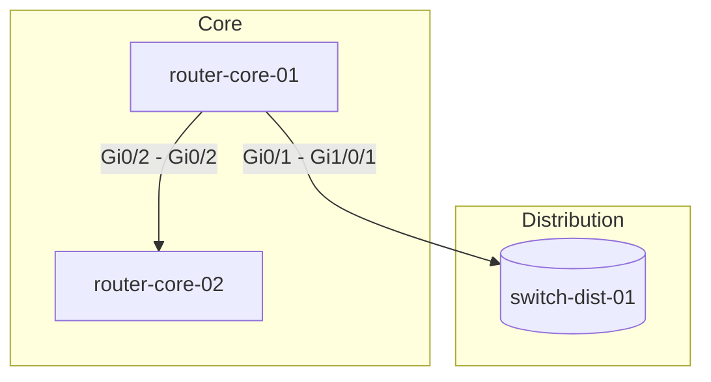

# Chapter 13: Network Documentation Basics

Auto-generate always-accurate documentation from network device configurations using AI.

## The Problem

Your network has 500 devices. Documentation exists in:
- Word docs on SharePoint (last updated 2019)
- Wiki pages (conflicting information)
- Tribal knowledge (in Bob's head, and Bob just left)
- Comments in configs (sometimes)
- Nowhere (most of the time)

A new engineer asks: "What's the BGP policy for AWS?" Nobody knows. It takes 3 days to figure out.

**Cost**: New engineer productivity delay, risk of misconfiguration, slow incident response.

**Solution**: AI-generated, always-current documentation that updates automatically from your network.

## Files in This Chapter

| File | Description | Lines | Key Features |
|------|-------------|-------|--------------|
| `doc_generator.py` | Device documentation generator | ~250 | Overview, interfaces, routing, security |
| `topology_diagrammer.py` | Network diagram generator | ~150 | CDP/LLDP parsing, Mermaid output |
| `documentation_pipeline.py` | Automated pipeline | ~200 | Scheduling, Git versioning, batch processing |

## Quick Start

```bash
# Setup
cd Chapter-13-Network-Documentation-Basics
python -m venv venv
source venv/bin/activate  # Windows: venv\Scripts\activate
pip install anthropic python-dotenv

# Configure
cp ../.env.example ../.env
# Edit ../.env and add your ANTHROPIC_API_KEY

# Run examples
python doc_generator.py
python topology_diagrammer.py
python documentation_pipeline.py --generate-now
```

## doc_generator.py

Generate comprehensive device documentation from configuration files.

**Features**:
- ✅ Device overview (role, management IP, protocols)
- ✅ Interface table in markdown
- ✅ Routing documentation (protocols, neighbors, policies)
- ✅ Security documentation (ACLs, AAA, management access)
- ✅ Complete documentation output to markdown file

**Usage**:

### Generate Device Overview
```python
from doc_generator import ConfigDocumentationGenerator

generator = ConfigDocumentationGenerator()

config = """
hostname router-core-01
!
interface Loopback0
 ip address 192.168.1.1 255.255.255.255
!
interface GigabitEthernet0/0
 description Uplink to ISP
 ip address 203.0.113.1 255.255.255.252
!
router bgp 65001
 neighbor 203.0.113.2 remote-as 65002
"""

# Generate overview
overview = generator.generate_device_overview(config, "router-core-01")

print(f"Role: {overview['role']}")
print(f"Management IP: {overview['management_ip']}")
print(f"Routing Protocols: {overview['routing_protocols']}")
```

**Output Example**:
```json
{
  "hostname": "router-core-01",
  "role": "Core Router / BGP Border Router",
  "management_ip": "192.168.1.1",
  "routing_protocols": ["BGP", "Static"],
  "key_features": ["BGP peering", "ISP uplink"],
  "interface_summary": "1 Loopback, 1 GigabitEthernet",
  "notable_config": "BGP AS 65001 with ISP peering to AS 65002"
}
```

### Generate Interface Table
```python
interface_table = generator.generate_interface_table(config)
print(interface_table)
```

**Output**:
```markdown
| Interface | IP Address | Status | Description | VLAN/VRF |
|-----------|------------|--------|-------------|----------|
| Loopback0 | 192.168.1.1/32 | Up | N/A | Global |
| GigabitEthernet0/0 | 203.0.113.1/30 | Up | Uplink to ISP | Global |
```

### Generate Complete Documentation
```python
# Generate full documentation and save to file
doc = generator.generate_complete_documentation(
    config=config,
    hostname="router-core-01",
    output_file="router-core-01.md"
)
```

**Generated File Structure**:
```markdown
# router-core-01 - Device Documentation

**Generated**: 2026-01-27T08:00:00
**Device Role**: Core Router
**Management IP**: 192.168.1.1

---

## Overview
**Routing Protocols**: BGP, OSPF
**Key Features**: ISP peering, HSRP

---

## Interfaces
| Interface | IP Address | Status | Description |
...

---

## Routing Configuration
### BGP
- AS Number: 65001
- Neighbors: 203.0.113.2 (AS 65002)
...

---

## Security Configuration
### Access Control
- MANAGEMENT_ACCESS ACL applied to VTY lines
...
```

## topology_diagrammer.py

Create network topology diagrams from CDP/LLDP neighbor data.

**Features**:
- ✅ Parse CDP/LLDP output
- ✅ Generate Mermaid diagram syntax
- ✅ Connection details table
- ✅ Multi-device topology support

**Usage**:

### Single Device Neighbors
```python
from topology_diagrammer import NetworkTopologyDiagrammer

diagrammer = NetworkTopologyDiagrammer()

cdp_output = """
Device ID: switch-dist-01
Interface: GigabitEthernet0/1, Port ID: GigabitEthernet1/0/1
Platform: cisco WS-C3850

Device ID: router-core-02
Interface: GigabitEthernet0/2, Port ID: GigabitEthernet0/2
Platform: Cisco 4451-X
"""

neighbors = diagrammer.extract_neighbors_from_cdp(cdp_output)
print(neighbors)
```

**Output**:
```json
[
  {
    "local_device": "router-core-01",
    "local_interface": "GigabitEthernet0/1",
    "remote_device": "switch-dist-01",
    "remote_interface": "GigabitEthernet1/0/1",
    "platform": "cisco WS-C3850"
  }
]
```

### Generate Mermaid Diagram
```python
cdp_data = {
    "router-core-01": "Device ID: switch-dist-01...",
    "switch-dist-01": "Device ID: router-core-01..."
}

topology_doc = diagrammer.create_topology_documentation(cdp_data)
print(topology_doc)
```

**Output (Mermaid)**:


**Tip**: Mermaid diagrams render automatically in GitHub, Notion, Confluence, and many documentation platforms.

## documentation_pipeline.py

Automate documentation generation for your entire network.

**Features**:
- ✅ Batch process multiple device configs
- ✅ Generate index page with links
- ✅ Git version control integration
- ✅ Scheduled daily updates
- ✅ Change detection (only update modified devices)

**Usage**:

### One-Time Generation
```bash
# Generate docs for all configs in ./configs directory
python documentation_pipeline.py --generate-now \
    --config-dir ./configs \
    --output-dir ./docs
```

### Scheduled Updates
```bash
# Run daily at 2:00 AM
python documentation_pipeline.py --schedule \
    --config-dir ./configs \
    --output-dir ./docs
```

### With Git Versioning
```bash
# Auto-commit changes to Git
python documentation_pipeline.py --generate-now \
    --config-dir ./configs \
    --output-dir ./docs \
    --git-repo /path/to/docs/repo
```

**Programmatic Usage**:
```python
from documentation_pipeline import DocumentationPipeline

pipeline = DocumentationPipeline(
    config_dir="./configs",
    output_dir="./docs",
    git_repo="./docs-repo"  # Optional
)

# Generate all documentation
pipeline.generate_all_documentation()

# Output:
# ============================================================
# Documentation Generation Started: 2026-01-27 02:00:00
# ============================================================
# Found 47 device configs
#   ✓ router-core-01
#   ✓ router-core-02
#   ✓ switch-dist-01
#   ...
#   ✓ Generated index: ./docs/index.md
#   ✓ Changes committed to Git
# ============================================================
# Documentation Generation Complete
# Total files: 48
# ============================================================
```

## CI/CD Integration

Automate documentation on every config change:

### GitHub Actions
```yaml
# .github/workflows/generate-docs.yml
name: Generate Network Documentation

on:
  push:
    paths:
      - 'configs/**'
  schedule:
    - cron: '0 2 * * *'  # Daily at 2 AM

jobs:
  generate-docs:
    runs-on: ubuntu-latest
    steps:
      - uses: actions/checkout@v3
      
      - name: Set up Python
        uses: actions/setup-python@v4
        with:
          python-version: '3.11'
          
      - name: Install dependencies
        run: pip install anthropic
        
      - name: Generate documentation
        env:
          ANTHROPIC_API_KEY: ${{ secrets.ANTHROPIC_API_KEY }}
        run: python documentation_pipeline.py --generate-now
        
      - name: Commit changes
        run: |
          git config user.name "docs-bot"
          git config user.email "docs-bot@company.com"
          git add docs/
          git diff --staged --quiet || git commit -m "Auto-update docs [skip ci]"
          git push
```

## Cost Reference

**Claude 3.5 Sonnet** pricing per device:
| Operation | Tokens | Cost |
|-----------|--------|------|
| Device Overview | ~1,500 | $0.01 |
| Interface Table | ~1,000 | $0.008 |
| Routing Docs | ~2,000 | $0.015 |
| Security Docs | ~2,000 | $0.015 |
| **Total per device** | ~6,500 | **~$0.05** |

**Cost Estimates**:
```
50 devices daily   →  $2.50/day   →  $75/month
200 devices daily  →  $10/day     →  $300/month
500 devices daily  →  $25/day     →  $750/month
```

**Cost Optimization Tips**:
1. **Use Haiku for simple extraction** - Interface tables, basic parsing (10x cheaper)
2. **Cache results** - Only regenerate when config changes
3. **Batch during off-peak** - Lower priority, scheduled runs
4. **Chunk large configs** - Stay within context limits

## Testing

```bash
# Test documentation generator
python doc_generator.py

# Test topology diagrammer
python topology_diagrammer.py

# Test pipeline (dry run with sample configs)
mkdir -p test_configs
echo "hostname test-router" > test_configs/test.cfg
python documentation_pipeline.py --generate-now --config-dir ./test_configs

# Run unit tests
pytest test_chapter13.py -v
```

## Common Issues

### "Config too large for context"
```
anthropic.BadRequestError: max tokens exceeded
```
**Fix**: Chunk the config or use a model with larger context. See Chapter 7: Context Management.

### "Rate limit exceeded"
```
anthropic.RateLimitError: rate_limit_error
```
**Fix**: Add delays between devices or use the rate limiter from Chapter 4.

### "Incomplete extraction"
AI misses some config sections.
**Fix**: Review prompt templates, add specific extraction instructions, or use two-pass extraction.

### "Sensitive data in docs"
Passwords/keys appearing in documentation.
**Fix**: Sanitize configs before processing. See Chapter 12: Ethics and Responsible AI.

## Best Practices

✅ **Automate generation** - Manual docs will drift
✅ **Version control docs** - Track changes over time
✅ **Generate on config change** - CI/CD integration
✅ **Include timestamps** - Know when docs were generated
✅ **Link from configs** - Point to generated docs in device descriptions
✅ **Review first run** - Validate AI output before trusting
✅ **Sanitize sensitive data** - Remove passwords, keys before AI processing

## Production Checklist

- [ ] Config fetching automated (Netmiko, NAPALM, or Git)
- [ ] Sensitive data sanitization in place
- [ ] Documentation pipeline scheduled
- [ ] Git versioning enabled
- [ ] Index page generated
- [ ] CI/CD workflow configured
- [ ] Cost monitoring in place
- [ ] Quality review process defined
- [ ] Stale doc alerts configured

## What Can Go Wrong

| Issue | Risk | Mitigation |
|-------|------|------------|
| Stale configs | Docs don't match reality | Fetch live configs from devices |
| API costs at scale | Unexpected bills | Set budgets, cache results |
| Git conflicts | Multiple update sources | Single automated process |
| Incomplete extraction | Missing information | Template validation, human review |
| Sensitive data exposure | Security breach | Sanitize before processing |

## Next Steps

- **Chapter 14**: RAG Fundamentals - Make this documentation searchable with AI
- **Chapter 15**: LangChain Integration - Build advanced documentation chains
- **Chapter 16**: Document Retrieval - Find answers in your docs instantly

## Resources

- [Mermaid Diagram Syntax](https://mermaid.js.org/syntax/flowchart.html)
- [GitHub Actions Documentation](https://docs.github.com/en/actions)
- [Anthropic API Best Practices](https://docs.anthropic.com/en/docs/build-with-claude/prompt-caching)

---

**Chapter 13 Complete** | Auto-generated network documentation ✅
