# Chapter 13: Network Documentation Basics

## Introduction

Network documentation is often called the "necessary evil" of IT operations. Everyone knows it's important. Everyone claims they'll maintain it. And yet, in nearly every organization, documentation exists in a fragmented state—scattered across shared drives, wikis, email archives, and the institutional knowledge of departing team members.

This chapter addresses one of the most persistent problems in network operations: **keeping documentation accurate and up-to-date as networks constantly evolve**.

### The Documentation Crisis

Let's be realistic: traditional network documentation fails for a simple reason—**it requires constant manual maintenance**. Every configuration change means someone must:

1. Make the change to the device
2. Test that it works
3. Update the documentation
4. Get approval from reviewers
5. Publish the changes
6. Notify stakeholders

By step 3, most teams are exhausted. The documentation update either gets postponed indefinitely or done hastily and inaccurately.

### The Problem Statement

Consider this scenario: Your company manages 500 network devices across 12 data centers and 47 branch offices. A new engineer (hired last week) is asked to verify the BGP configuration for your AWS peering connection. They need to know:

- What's the current BGP AS number?
- What neighbors are configured?
- Which networks are advertised?
- Are there route filters applied?
- When was this last changed?

Where do they look?

**Option A**: Search SharePoint for "BGP AWS"
- Finds a document last updated in 2019
- Contains different AS numbers than what's actually running
- Decision: **Not trustworthy**

**Option B**: Check the wiki
- Multiple conflicting entries
- Different people describing the same thing differently
- No indication which is correct
- Decision: **Too confusing**

**Option C**: Ask the network team
- Senior engineer shows the running config
- Explains the current state verbally
- New engineer writes notes by hand
- Later realizes they missed critical details
- Decision: **Error-prone and doesn't scale**

**Option D**: Ask ChatGPT
- It confidently returns completely wrong information
- Junior engineer trusts it anyway
- Causes an outage when applied to production
- Decision: **Dangerous**

**The real answer should be Option E**: Access auto-generated, always-current documentation that was built directly from the actual running configurations.

### Why This Matters

Documentation problems manifest as:

| Impact | Cost |
|--------|------|
| **Onboarding delays** | New engineers spend 3-5 days understanding the network instead of 1 day |
| **Troubleshooting slowness** | Engineers waste hours tracing through configs to understand intent |
| **Risk of misconfiguration** | Without clear documentation, changes are made blindly |
| **Compliance violations** | Auditors find undocumented configurations and flag as non-compliant |
| **Knowledge loss** | When experienced engineer leaves, critical knowledge walks out the door |
| **Incident response delays** | During an outage, time spent understanding the topology compounds the problem |

---

## The Solution: AI-Powered Documentation

Instead of fighting to maintain documentation manually, what if **the documentation was automatically generated from the source of truth—the device configurations themselves**?

This is the premise of this chapter: **Use AI to analyze network device configurations and automatically generate comprehensive, accurate documentation.**

### Why AI is the Right Tool

AI models like Claude excel at tasks that require:
- **Understanding context** - Recognizing that `ip ospf cost 100` has different meaning on a WAN link vs LAN link
- **Synthesis** - Combining scattered configuration blocks into coherent narrative (BGP config spread across 20 lines of CLI into organized documentation)
- **Inference** - Deducing a device's role from its configuration ("This is a core router because it has BGP, OSPF, and connects multiple sites")
- **Multi-vendor compatibility** - Understanding Cisco IOS, NX-OS, Juniper Junos, Arista EOS with the same approach

### The Philosophy

The code in this chapter follows one principle: **Documentation should be generated, not written.**

- **Generated from configs**: Always in sync with running state
- **Generated on schedule**: Daily/hourly, before config changes take effect
- **Generated on change**: Before/after comparisons for auditing
- **Generated programmatically**: No human bottleneck

---

## Real-World Use Case: Enterprise Network Documentation

### The Scenario

TechCorp manages a large enterprise network:
- **500 devices** across 15 locations
- **3 NOC shifts** handling operations 24/7
- **12 network engineers** maintaining the network
- **Quarterly audits** requiring full configuration documentation

**The problem they faced:**
- Documentation took 2 weeks of manual work per quarter
- Different people documented things differently
- Formats were inconsistent (some markdown, some Word docs)
- Auditors requested printed documentation (causing more manual work)
- When urgent changes needed, documentation was never updated

**The solution:**
- Automated documentation generation running daily
- Generated documents stored in Git (version control + history)
- Reports automatically generated for audits (PDF from markdown)
- Change validation: Compare before/after configs
- Onboarding: New engineer sees exactly what's configured, not outdated docs

**The results:**
- Documentation generation takes 2 hours instead of 80 hours
- Quality improved (AI catches things humans miss)
- Compliance ready at any time (not after manual scramble)
- Onboarding time reduced from 5 days to 2 days

---

## Core Concepts

### Multi-Vendor Support

The code in this chapter handles multiple vendors:

```
Cisco IOS      → Standard enterprise routing/switching
Cisco NX-OS    → Data center environments
Cisco ASA      → Firewall configurations
Juniper Junos  → High-end routers and switches
Arista EOS     → Modern cloud networking
Palo Alto      → Next-gen firewalls
Fortinet       → SMB firewalls
```

The generator auto-detects the vendor from config characteristics.

### Four-Step Documentation Pipeline

```
┌─────────────────────────────────────────────────────┐
│ STEP 1: Fetch Configurations                       │
│ Pull running configs from devices (Netmiko, NAPALM) │
└────────────────┬────────────────────────────────────┘
                 │
┌────────────────▼────────────────────────────────────┐
│ STEP 2: Analyze Configurations                     │
│ Extract device role, interfaces, routing, security │
└────────────────┬────────────────────────────────────┘
                 │
┌────────────────▼────────────────────────────────────┐
│ STEP 3: Generate Documentation                     │
│ Create markdown docs with tables, diagrams, notes  │
└────────────────┬────────────────────────────────────┘
                 │
┌────────────────▼────────────────────────────────────┐
│ STEP 4: Distribute & Version                       │
│ Commit to Git, publish to wiki, alert stakeholders │
└─────────────────────────────────────────────────────┘
```

---

## Files in This Chapter

| File | Purpose | Size | Key Methods |
|------|---------|------|-------------|
| `doc_generator.py` | Core documentation generation | ~800 lines | `generate_device_overview()`, `generate_complete_documentation()`, device type detection |
| `doc_analyzer.py` | Configuration analysis & validation | ~400 lines | `analyze_security()`, `analyze_best_practices()`, `analyze_redundancy()` |
| `topology_diagrammer.py` | Network diagram generation | ~400 lines | `extract_neighbors_from_cdp()`, `generate_mermaid_diagram()` |
| `documentation_pipeline.py` | Automation orchestration | ~500 lines | `generate_all_documentation()`, batch processing, scheduling |

**Total**: 2,100+ lines of production-ready code

---

## Installation & Setup

### Prerequisites

```bash
# Python 3.10+
python --version

# API key from Anthropic (https://console.anthropic.com)
export ANTHROPIC_API_KEY="sk-ant-api03-..."
```

### Install Dependencies

```bash
cd Chapter-13-Network-Documentation-Basics

# Create virtual environment
python -m venv venv
source venv/bin/activate  # Windows: venv\Scripts\activate

# Install requirements
pip install anthropic python-dotenv schedule gitpython
```

### Configure

```bash
# Copy example environment file
cp ../../.env.example .env

# Edit .env and add your Anthropic API key
ANTHROPIC_API_KEY=sk-ant-api03-...
```

---

## Part 1: Documentation Generation (`doc_generator.py`)

This module handles the core task of analyzing device configs and generating documentation.

### Core Classes

**ConfigDocumentationGenerator**
- Main class for documentation generation
- Handles multi-vendor device support
- Tracks API usage and costs
- Supports multiple output formats

**Data Classes**
- `DeviceOverview` - High-level device info
- `InterfaceInfo` - Interface details
- `VlanInfo` - VLAN configuration
- `RoutingProtocol` - Routing protocol info

### Auto-Detecting Device Type

The generator automatically identifies device type from configuration patterns:

```python
from doc_generator import ConfigDocumentationGenerator

generator = ConfigDocumentationGenerator()

# Auto-detects from config patterns
device_type = generator.detect_device_type(config_text)
print(device_type)  # DeviceType.CISCO_IOS

hostname = generator.extract_hostname(config_text)
print(hostname)  # "router-core-01"
```

### Extracting Information Without API Calls

For cost optimization, the generator uses regex-based extraction for basic info:

```python
# These don't require API calls (fast, free)
interfaces = generator.extract_interfaces_basic(config)
vlans = generator.extract_vlans_basic(config)
hostname = generator.extract_hostname(config)

for interface in interfaces:
    print(f"{interface.name}: {interface.ip_address or 'No IP'}")
```

### Generating Complete Documentation

```python
# Full documentation (uses API)
doc = generator.generate_complete_documentation(
    config=device_config,
    hostname="router-core-01",
    output_file="router-core-01.md",
    include_vlans=True
)

# Check API usage
stats = generator.get_usage_stats()
print(f"Cost: ${stats['estimated_cost_usd']:.4f}")
print(f"Tokens: {stats['input_tokens']} in + {stats['output_tokens']} out")
```

### Generated Documentation Structure

The output markdown includes:

```markdown
# router-core-01 - Network Device Documentation

| Property | Value |
|----------|-------|
| Generated | 2026-01-27T08:00:00 |
| Device Role | Core Router |
| Management IP | 192.168.1.1 |

## Executive Summary
...

## Interface Configuration
...

## Routing Configuration
...

## VLAN Configuration
...

## Security Configuration
...
```

### Cost Optimization

**Model Selection**:
- Haiku: $0.80/$4 per million tokens (10x cheaper, for simple extraction)
- Sonnet: $3/$15 per million tokens (recommended, balanced)

**Estimating Costs**:
```python
# Per device breakdown
Overview:      ~500 tokens = $0.01
Interfaces:    ~800 tokens = $0.03
Routing:      ~1500 tokens = $0.05
Security:     ~1500 tokens = $0.05
Total/device: ~4300 tokens = $0.14

# For network
50 devices/month:   $7
200 devices/month:  $28
500 devices/month:  $70
```

---

## Part 2: Configuration Analysis (`doc_analyzer.py`)

This module analyzes configs for issues, not just documents them.

### Analysis Categories

**Security Analysis**
- Telnet/HTTP access methods
- Weak SNMP community strings
- Missing enable secret
- Unprotected console access
- Missing logging
- CDP information leakage

**Best Practices**
- NTP not configured
- DNS not configured
- Banner MOTD missing
- No comment documentation
- Limited interface descriptions

**Redundancy**
- No HSRP/VRRP on core devices
- Spanning tree not configured
- No link aggregation

**Compliance**
- Configuration changes not logged
- No audit trail
- Missing security controls

### Using the Analyzer

```python
from doc_analyzer import ConfigAnalyzer, Severity

analyzer = ConfigAnalyzer()
report = analyzer.analyze_config(device_config)

print(f"Total Findings: {report['total_findings']}")
print(f"Risk Score: {report['total_risk_score']}/100")

for finding in report['findings']:
    if finding.severity == Severity.CRITICAL:
        print(f"❌ {finding.title}")
        print(f"   {finding.description}")
        print(f"   Fix: {finding.recommendation}")
```

### Example Output

```
❌ Telnet Enabled
   Telnet transmits credentials and data in cleartext.
   Fix: Remove telnet: 'no transport input telnet' and ensure SSH is enabled

⚠️  Default SNMP Community
   Using default SNMP community string (public/private)
   Fix: Change to unique string or enable SNMPv3

✓ HSRP Configured
   First-hop redundancy protocol in place
```

---

## Part 3: Topology Visualization (`topology_diagrammer.py`)

This module creates visual network topology diagrams.

### From CDP Output to Diagram

**Input: CDP output**
```
Device ID: switch-dist-01
Interface: GigabitEthernet0/1, Port ID: GigabitEthernet1/0/1
Platform: cisco WS-C3850

Device ID: router-core-02
Interface: GigabitEthernet0/2, Port ID: GigabitEthernet0/2
Platform: Cisco 4451-X
```

**Process**: Extract → Deduplicate → Generate Mermaid → Render

**Output: Mermaid diagram**

```mermaid
flowchart TB
    R1["🔲 router-core-01"]
    R2["🔲 router-core-02"]
    SW1["🔶 switch-dist-01"]
    
    R1 -->|Gi0/1 - Gi1/0/1| SW1
    R1 -->|Gi0/2 - Gi0/2| R2
```


### Usage

```python
from topology_diagrammer import NetworkTopologyDiagrammer

diagrammer = NetworkTopologyDiagrammer()

cdp_data = {
    "router-core-01": "Device ID: switch-01...",
    "switch-dist-01": "Device ID: router-01..."
}

topology_doc = diagrammer.create_topology_documentation(cdp_data)
print(topology_doc)  # Markdown with embedded Mermaid
```

### Supported Platforms

- GitHub (renders automatically in README.md)
- Notion (with Mermaid widget)
- Confluence (with Diagram plugin)
- GitLab (renders in markdown)
- Any standard markdown viewer

---

## Part 4: Automation Pipeline (`documentation_pipeline.py`)

This module orchestrates batch generation, scheduling, and Git integration.

### Batch Processing Multiple Devices

```python
from documentation_pipeline import DocumentationPipeline

pipeline = DocumentationPipeline(
    config_dir="./configs",      # Directory with .cfg files
    output_dir="./docs",          # Output location
    git_repo="./docs-repo"        # Git repo for versioning
)

# Generate all at once
pipeline.generate_all_documentation()
```

**Output**:
```
============================================================
Documentation Generation Started: 2026-01-27 02:00:00
============================================================
Found 47 device configs

  → router-core-01
    ✓ Overview extracted
    ✓ Interfaces documented
    ✓ Routing documented
    ✓ Security documented

  → router-core-02
    ...

Generated 47 device documentation files
Generated index: docs/README.md
Committed to Git: "Auto-update network documentation - 2026-01-27 02:00:00"
```

### Smart Change Detection

Only regenerate devices with changed configs (saves API costs):

```python
# Pipeline tracks config hashes
# Only regenerates if config changed
pipeline.generate_all_documentation()  # Skips unchanged configs
```

### Scheduled Daily Updates

```bash
# Schedule daily 2 AM generation
python documentation_pipeline.py --schedule
```

Or integrate with cron:

```bash
# Run daily at 2:00 AM
0 2 * * * cd /path/to/docs && python documentation_pipeline.py --generate-now
```

### Git Integration

Every generation creates a commit:

```bash
git log docs/
# commit abc123 - Auto-update network documentation - 2026-01-27 02:00:00
# commit def456 - Auto-update network documentation - 2026-01-26 02:00:00
# commit ghi789 - Auto-update network documentation - 2026-01-25 02:00:00
```

View changes between days:

```bash
git diff abc123 def456 docs/router-core-01.md
# Shows exactly what changed
```

---

## Advanced Usage Patterns

### Pattern 1: Pre/Post Change Documentation

```bash
# Before change
python doc_generator.py --config before.cfg --output before-doc.md

# Make change to device
ssh router make-change

# After change
python doc_generator.py --config after.cfg --output after-doc.md

# Diff to see what changed
diff before-doc.md after-doc.md
```

### Pattern 2: Documentation as Validation

Use the analyzer to ensure changes don't introduce security issues:

```python
analyzer = ConfigAnalyzer()
report = analyzer.analyze_config(new_config)

if any(f.severity == Severity.CRITICAL for f in report['findings']):
    print("❌ Critical findings - blocking deployment")
    exit(1)

print("✓ Config passed validation - safe to deploy")
```

### Pattern 3: Documentation API

Generate docs via REST API:

```python
from fastapi import FastAPI
from doc_generator import ConfigDocumentationGenerator

app = FastAPI()
generator = ConfigDocumentationGenerator()

@app.post("/generate-docs")
async def generate_docs(hostname: str, config: str):
    doc = generator.generate_complete_documentation(config, hostname)
    return {"documentation": doc}
```

### Pattern 4: Multi-Format Export

```python
from doc_generator import OutputFormat

# Generate in all formats
doc_md = generator.generate_complete_documentation(config, format=OutputFormat.MARKDOWN)
doc_html = generator.generate_complete_documentation(config, format=OutputFormat.HTML)
doc_json = generator.generate_complete_documentation(config, format=OutputFormat.JSON)
```

---

## Integration with CI/CD

### GitHub Actions Workflow

```yaml
name: Generate Network Documentation

on:
  push:
    paths:
      - 'configs/**'
  schedule:
    - cron: '0 2 * * *'  # Daily at 2 AM

jobs:
  document:
    runs-on: ubuntu-latest
    steps:
      - uses: actions/checkout@v3
      - uses: actions/setup-python@v4
        with:
          python-version: '3.11'
      
      - run: pip install anthropic
      - env:
          ANTHROPIC_API_KEY: ${{ secrets.ANTHROPIC_API_KEY }}
        run: python documentation_pipeline.py --generate-now
      
      - run: |
          git config user.name "docs-bot"
          git config user.email "bot@company.com"
          git add docs/
          git diff --staged --quiet || git commit -m "Auto-update documentation"
          git push
```

### GitLab CI Integration

```yaml
generate-docs:
  image: python:3.11
  script:
    - pip install anthropic
    - python documentation_pipeline.py --generate-now
  artifacts:
    paths:
      - docs/
  schedule:
    - cron: "0 2 * * *"
  only:
    - changes:
      - configs/**
```

---

## Production Deployment Guide

### Prerequisites Checklist

- [ ] API key stored in secrets manager (not .env)
- [ ] Configs accessible (Netmiko/NAPALM configured)
- [ ] Output directory has Git repo initialized
- [ ] Email alerts configured for errors
- [ ] Monitoring in place for API usage

### Step 1: Test Locally

```bash
# Generate docs for single device
python doc_generator.py

# Review output
cat router-core-01-doc.md

# Check for issues
python doc_analyzer.py
```

### Step 2: Schedule Batch Run

```bash
# Create cron job for daily generation
crontab -e
# Add: 0 2 * * * cd /path && python documentation_pipeline.py --generate-now
```

### Step 3: Monitor & Alert

```python
# Monitor API costs
stats = generator.get_usage_stats()
if stats['estimated_cost_usd'] > BUDGET:
    send_alert("Documentation generation exceeding budget")

# Monitor for errors
try:
    pipeline.generate_all_documentation()
except Exception as e:
    send_slack_alert(f"Documentation generation failed: {e}")
```

### Step 4: Archive & Backup

```bash
# Backup documentation Git repo weekly
git push backup master
```

---

## Troubleshooting

### "Config too large for context"
**Symptom**: Error about exceeding token limits
**Solution**: Chunk large configs or use models with larger context (Opus: 200K tokens)

### "Rate limit exceeded"
**Symptom**: API returns 429 error
**Solution**: Add delays between devices or use rate limiter:
```python
from time import sleep
for device in devices:
    generate_doc(device)
    sleep(1)  # 1 second between calls
```

### "Incomplete extraction"
**Symptom**: Some configuration sections missing from docs
**Solution**: Review AI prompt quality, add specific extraction instructions, use two-pass extraction

### "Sensitive data in docs"
**Symptom**: Passwords appearing in documentation
**Solution**: Sanitize configs before processing (remove passwords, remove secrets)

---

## Exercises for Practice

### Exercise 1: Basic Documentation Generation
Generate documentation for a provided router config file. Compare with manual documentation to identify differences.

### Exercise 2: Configuration Analysis
Run the analyzer on a config and fix all CRITICAL findings. Re-run to verify.

### Exercise 3: Multi-Device Pipeline
Set up the documentation pipeline for 5 test device configs. Observe change detection when you modify one.

### Exercise 4: API Integration
Create a simple REST API using FastAPI that accepts a config and returns documentation.

### Exercise 5: Production Deployment
Set up scheduled documentation generation with Git versioning for a simulated network environment.

---

## Best Practices Summary

✅ **Automate everything** - Schedule daily generation
✅ **Version control** - Keep documentation in Git
✅ **Validate before deploy** - Use analyzer to check for issues
✅ **Document WHY not WHAT** - Add context to auto-generated docs
✅ **Cache and optimize** - Only regenerate changed devices
✅ **Monitor costs** - Track API usage
✅ **Alert on errors** - Know when generation fails
✅ **Review periodically** - Ensure accuracy
✅ **Involve the team** - Get feedback on docs

---

## What Can Go Wrong

| Scenario | Risk | Mitigation |
|----------|------|-----------|
| Stale configs | Docs don't match reality | Fetch live configs from devices every time |
| API rate limits | Generation fails | Use rate limiting, lower frequency, upgrade API tier |
| Sensitive data exposure | Security breach | Sanitize all configs before sending to AI |
| Cost explosion | Unexpected API bills | Monitor usage, set budget alerts, cache results |
| Git conflicts | Multiple update sources | Single automated process only |
| Incomplete extraction | Missing documentation | Validate first run, add prompt improvements |
| Accuracy issues | Trust in docs decreases | Include confidence scores, require human review |

---

## Chapter Summary

This chapter showed how to solve a critical network operations problem: **keeping documentation accurate and current**.

### Key Takeaways

1. **Auto-generate from source of truth** - Configs, not memory
2. **Use AI for synthesis** - It handles complexity humans miss
3. **Build pipelines, not scripts** - Automation at scale
4. **Validate everything** - Analyzer catches issues before they hurt
5. **Version and track** - Git provides history and accountability
6. **Monitor and optimize** - Know your costs
7. **Make it production-ready** - This isn't a one-off tool

### Costs vs Benefits

| Aspect | Cost | Benefit |
|--------|------|---------|
| **API calls** | $50-200/month | Documentation always current |
| **Implementation** | 4-8 hours | Saves 40+ hours of manual work/quarter |
| **Maintenance** | Minimal | Scales to 1000s of devices |
| **Learning curve** | 2-4 hours | Empowers entire team |

---

## Next Chapter

**Chapter 14: RAG Fundamentals** - Make this documentation searchable with AI.

Your auto-generated documentation is only useful if people can find answers in it. Chapter 14 shows how to build a Retrieval-Augmented Generation (RAG) system that lets anyone ask questions in plain English and get answers from your documentation.

**Preview**: "What's the OSPF configuration on the backup core router?"
```
>> RAG system searches documentation
>> Finds relevant sections
>> Claude synthesizes the answer
<< "The backup core router (router-core-02) runs OSPF process 1 with..."
```

---

## Resources

### Code Files
- `doc_generator.py` - 800 lines, documentation generation
- `doc_analyzer.py` - 400 lines, configuration analysis
- `topology_diagrammer.py` - 400 lines, network diagram generation
- `documentation_pipeline.py` - 500 lines, automation orchestration

### External References
- [Anthropic Claude API Documentation](https://docs.anthropic.com/)
- [Mermaid Diagram Documentation](https://mermaid.js.org/)
- [GitHub Actions Documentation](https://docs.github.com/en/actions)
- [Netmiko - Device Automation](https://github.com/ktbyers/netmiko)
- [NAPALM - Multi-vendor Automation](https://napalm.readthedocs.io/)

### Related Topics
- Configuration management (Ansible, Terraform)
- Network monitoring (Prometheus, Grafana)
- Compliance automation
- Change management
- Knowledge management

---

**Chapter 13 Complete** ✓

*Generated documentation beats manual documentation every single time.*
